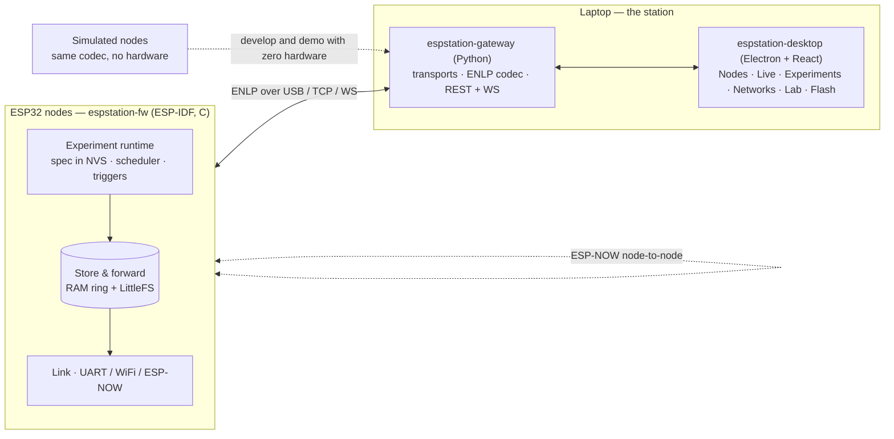

# EspStation

A workbench for **ESP32 experiments and node networks**. Define an experiment,
push it to one node or twenty, watch them live while they're tethered — then
**unplug the cable and walk away** while they keep doing the job in production.



> **Status:** S0 — foundation. The contracts, scaffolding and simulator are in
> place; hardware validation on a real board is [S1](docs/ROADMAP.md#s1--the-link-is-real).
> Read [`SPRINT_STATUS.md`](SPRINT_STATUS.md) for exactly what works today.

## The idea

> **PiStation:** the Pi is a sensor and actuator; the laptop is the brain.
> **EspStation:** *the node is autonomous; the station is a laboratory.*

An ESP32 is not a computer you administer — it is deployed in a field, on a
battery, inside a payload, with nobody watching. So the experiment lives **on
the node**, in NVS, and runs across reboots with or without a station
connected. The station observes, configures and orchestrates. It is never in a
control loop. Unplug it and nothing changes except that telemetry goes to
storage instead of to a screen.

## What it does

- **Declarative experiments.** An experiment is a JSON document — channels,
  sample rates, triggers, actions, duration — pushed to the node and persisted.
  Reconfiguring twenty nodes is editing a document, not twenty rebuild-and-flash
  cycles. ([spec](docs/EXPERIMENTS.md))
- **Live instrumentation while tethered.** Telemetry, structured logs and events
  over USB or WiFi, charted from the node's own declared channel table — the
  station hard-codes nothing, so adding a sensor driver needs no station change.
- **Autonomy and store-and-forward.** Lose the link and the node keeps running
  and keeps buffering; reconnect and it backfills without stalling the live
  view. A durability watermark means the node only frees data the station has
  actually committed.
- **Node networks.** ESP-NOW meshes, topology graphs, loss/latency/RSSI
  matrices, and protocol test benches — for sensor networks, IoT, smart-grid and
  aerospace payload experiments.
- **Zero-hardware development.** Simulated nodes speak byte-identical protocol
  through the *same* codec as the serial path, so a twenty-node mesh is
  demoable on a laptop and contract drift is impossible by construction.
- **One operator app.** Electron + React: Nodes, Live, Experiments, Networks,
  Lab, Flash — light and dark, packaged as an AppImage/`.deb`.

## Quick start (no hardware needed)

```bash
git clone https://github.com/trimaxlan98/espstation && cd espstation

make -C firmware/test/host test          # codec tests, seconds, no toolchain

cd gateway && ~/.local/bin/virtualenv .venv && .venv/bin/pip install -e ".[dev]"
.venv/bin/python -m espstation_gateway --sim --port 8787   # simulated nodes

cd ../desktop && npm install && npm run dev
```

`make check` runs every gate that does not need hardware — the same set CI
runs. `make help` lists the rest.

Full instructions, the ESP32 toolchain, and the `dialout` permission you will
hit within five minutes: [`docs/SETUP.md`](docs/SETUP.md).

## Repository

| Path | What |
|---|---|
| `firmware/` | `espstation-fw` — C11 / ESP-IDF 5.x via PlatformIO, multi-target |
| `gateway/` | `espstation-gateway` — Python 3.11 / FastAPI; owns the ports, the codec and the database |
| `desktop/` | `espstation-desktop` — TypeScript / Electron + React |
| `protocol/` | **The contract.** [`PROTOCOL.md`](protocol/PROTOCOL.md) is law |
| `docs/` | [Architecture](docs/ARCHITECTURE.md) · [Experiments](docs/EXPERIMENTS.md) · [Roadmap](docs/ROADMAP.md) · [Decisions](docs/DECISIONS.md) · [Setup](docs/SETUP.md) |
| `tools/` | Protocol drift gate, agent-definition sync, serial frame sniffer |

## Contributing — including with AI agents

Start at [`AGENTS.md`](AGENTS.md). It is the entry point for AI coding agents
(Claude Code, Codex, and others) and the short version for humans: the one
invariant you must not violate, the hard rules, how to run everything, and the
definition of done. Agent roles live in `.claude/agents/` and are mirrored to
`.codex/agents/` by `tools/sync_agents.py`.

You do not need an ESP32 to contribute. Most of the system is built and
verified against the simulator.

## Relationship to PiStation

[PiStation](https://github.com/trimaxlan98/pistation-mission-control) operates
**one powerful node** as a satellite ground station. EspStation operates **many
tiny nodes** as a distributed experiment. They are siblings, and
[S10](docs/ROADMAP.md#s10--aerospace) joins them: the ESP32 network becomes a
payload segment feeding PiStation's CCSDS ground segment — a small aerospace
testbed built from parts already on the bench.

## License

MIT — see [LICENSE](LICENSE).
