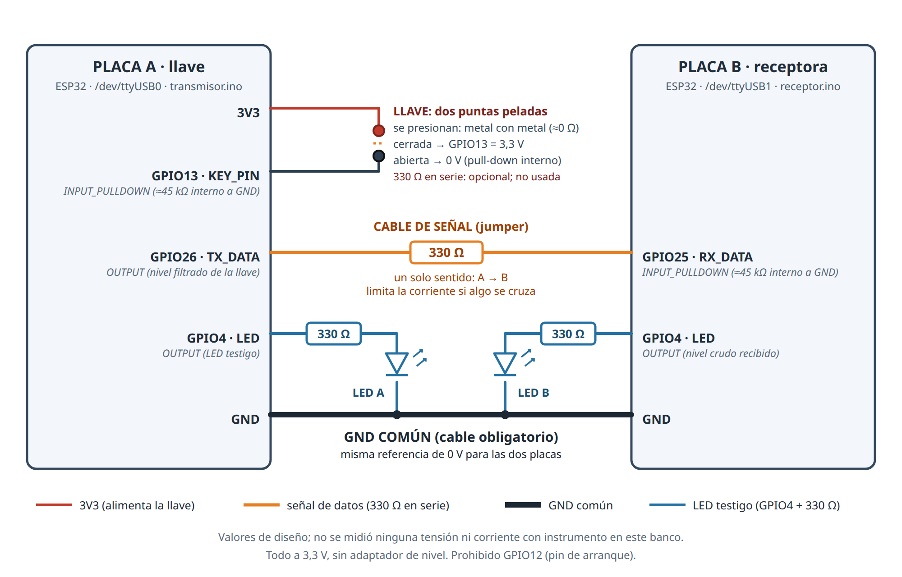

# Clave Morse táctil entre dos ESP32 — informe de práctica

| Campo | Valor |
|---|---|
| **Práctica** | Transmitir Morse tecleado a mano de una placa a otra por un cable y decodificarlo (texto + byte ASCII en binario) |
| **Fecha del banco** | 2026-09-21 |
| **Autor** | Yuritzi Elena Ordaz Huerta · Maestría en Tecnología Avanzada, UPIITA-IPN |
| **Hardware** | 2 × ESP32 WROOM (placa de desarrollo con USB-serie CP2102) |
| **Software** | `arduino-cli` 1.5.1 · core `esp32:esp32` 3.3.11 · FQBN `esp32:esp32:esp32` · serie a 115200 |
| **Probado en** | Linux (única plataforma usada). Windows/macOS no se probaron. |

> **Cómo leer este paquete.** Este informe explica todo. La **interfaz gráfica** está en
> `visor/index.html` (ábrela con doble clic en cualquier navegador; no necesita internet ni instalar nada).
> La **evidencia cruda** está en `evidencia/`. El diagrama del circuito está en `docs/circuito.svg` (y `docs/circuito.png`).

---

## 1. Resumen (lo que se hizo y lo que NO se consiguió)

Un operador presiona **dos puntas de jumper peladas** una contra otra (una *llave* táctil) conectadas a la placa **A**. La placa A copia ese
nivel, en vivo, por **un cable de señal** hasta la placa **B**. La placa B mide cuánto dura cada pulso, decide si es **punto** o **raya**, junta
puntos y rayas en **letras** con una tabla Morse y las imprime por el monitor serie **como texto y como su byte ASCII de 8 bits**.

| Resultado | Estado |
|---|---|
| Circuito montado y funcionando: la llave de A llega a B y B decodifica | **Medido en hardware** |
| El enlace no pierde flancos (flancos aceptados en A = flancos vistos en B) | **Medido** en las tandas 1, 2 y 4 (62=62, 56=56, 48=48). En la tanda 3, B contó 55 frente a 54 (1 activación de ISR sin cambio de nivel, causa no determinada). |
| Decodificar `SOS` a mano | **Parcial y no robusto.** Con los umbrales de arranque, 0 de 3 (tanda 1). Tras calibrar con el operador: 2 de 3 (tanda 3), pero **0 de 3 en la repetición con umbrales congelados (tanda 4)**. Con umbrales congelados: 2 de 6. |
| Antirrebote necesario | **Medido:** el pin dio 298 cambios crudos para 56 flancos aceptados (tanda 2). Con 15 ms un toque se partió en dos pulsos; con 25 ms, 27 toques dieron 27 pulsos (una sola tanda). |
| La lógica de decodificación es correcta y reproduce a la placa real | **Verificado sin hardware** (sección 7): el `receptor.ino` compilado en el PC reproduce exactamente los 163 eventos que imprimió la placa real en las 4 tandas |
| Tasa de acierto de la decodificación | **NO medida.** Un operador, cuatro tandas: 2 de 3 y 0 de 3 no son una tasa. |
| Latencia de la ISR, tensiones y corrientes reales, longitud del cable | **NO medidos** (no hubo instrumento). |

**Conclusión honesta:** el montaje eléctrico y la transmisión funcionan; **la decodificación automática de Morse tecleado a mano es frágil**,
porque una persona no mantiene un ritmo constante (sus rayas y pausas cambiaron ~2× entre tandas) y los umbrales son fijos. Eso es un
hallazgo de la práctica, no un fallo de la lógica (sección 8).

---

## 2. Qué demuestra la práctica

1. **Un nivel lógico es una tensión respecto a una referencia**: por eso el **GND común** es obligatorio (sección 4.4).
2. **Una entrada no puede quedar flotante**: `INPUT_PULLDOWN` da un 0 definido con la llave abierta (sección 4.5).
3. **El contacto mecánico rebota**: hace falta antirrebote, y se midió cuánto rebota (sección 8.3).
4. **Sondeo frente a interrupción**: A **sondea** (los tiempos humanos son de ms, el `loop()` es de µs); B usa **interrupciones** para sellar el instante
   exacto de cada flanco sin perderlo mientras imprime.
5. **De duraciones a símbolos y de símbolos a bytes**: punto/raya por umbral de duración; letra/palabra por umbral de silencio; carácter → byte ASCII de 8 bits.
6. **Medir con honestidad**: separar lo medido, lo calculado y lo no probado, y publicar también los fallos.

---

## 3. Material y software

### 3.1 Material (lo que usó el banco)

| Cant. | Elemento | Notas |
|---|---|---|
| 2 | Placa ESP32 WROOM de desarrollo con CP2102 | Lógica a **3,3 V**. Se distinguen por etiqueta física: **A** = `/dev/ttyUSB0`, **B** = `/dev/ttyUSB1` |
| 2 | Cable USB **de datos** | Alimenta cada placa y da el puerto serie. Un cable «solo carga» no funciona |
| 3 | Resistencia de **330 Ω** | 1 en la señal + 1 por cada LED |
| 2 | LED | Color no registrado; lleva su resistencia de 330 Ω en serie |
| ≥ 5 | Cables jumper (Dupont) | 3V3→llave · llave→GPIO13 · señal (con resistencia) · GND↔GND · LED. Más **2 jumpers pelados** que hacen de llave |
| — | Protoboard | **No registrado** si se usó protoboard o conexiones directas |

Marca, longitud de los cables y color del LED **no se anotaron** durante la sesión. La llave **no** llevó resistencia en serie.

### 3.2 Software

- **Para montar y probar en placa:** `arduino-cli` con el core `esp32:esp32` (`arduino-cli core install esp32:esp32`, ~1 GB) y acceso al puerto serie
  (en Linux, pertenecer al grupo `dialout`: `sudo usermod -aG dialout $USER` y **volver a iniciar sesión**).
- **Para las pruebas sin hardware (opcionales):** `g++` (con ASan/UBSan), `python3`, y `node` (solo para comparar el visor).
- **Para capturar logs y para ver el circuito en directo (opcional):** `python3` + `pyserial` (`pip install pyserial`).

---

## 4. Conexiones y circuito — qué es cada cable y **por qué**



_(mismo diagrama en vectorial: `docs/circuito.svg`; interactivo en `visor/index.html`, pestaña 4)._

### 4.1 Lista de conexiones

| # | Desde → hasta | Elemento | Función |
|---|---|---|---|
| 1 | **A · 3V3** → punta pelada 1 | jumper | Lleva 3,3 V a un lado de la llave |
| 2 | punta pelada 2 → **A · GPIO13** | jumper | Entrada de la llave (`KEY_PIN`, `INPUT_PULLDOWN`) |
| 3 | **A · GPIO26** → **B · GPIO25** | jumper + **330 Ω** en serie | Señal de datos, un solo sentido (A→B) |
| 4 | **A · GND** ↔ **B · GND** | jumper | **GND común** (obligatorio) |
| 5 | **A · GPIO4** → 330 Ω → LED → GND | resistencia + LED | Testigo de A: estado de la llave ya filtrado |
| 6 | **B · GPIO4** → 330 Ω → LED → GND | resistencia + LED | Testigo de B: nivel recibido por el cable |
| 7 | A y B ↔ PC | cable USB | Alimentación + puerto serie (115200) |

**Comprobación rápida de que el montaje está bien:** al presionar la llave se enciende el LED de A y, a la vez, el LED de B. Con la llave
abierta los dos están apagados.

### 4.2 Por qué la llave es «metal contra metal» y no el dedo

Si una punta va a 3V3 y cierras el circuito **con el dedo** hacia un pin con pull-down, la piel es una **resistencia variable** (del orden de
1 kΩ mojada a más de 500 kΩ seca) que forma un **divisor de tensión** contra el pull-down interno (≈45 kΩ):

```
V_pin = 3,3 V · R_pulldown / (R_piel + R_pulldown)      con R_pulldown ≈ 45 kΩ
```

Con umbrales lógicos habituales de ≈0,25·VDD (0,83 V) para el 0 y ≈0,75·VDD (2,48 V) para el 1, el pin queda en la **zona indefinida** para una piel de
unos **15 kΩ a 135 kΩ**, y el valor cambia con la humedad de la mano. _(Cálculo de diseño; los umbrales hay que confirmarlos en el datasheet del ESP32 y no se midieron aquí.)_
Con **dos puntas de jumper peladas** presionadas una contra otra, los dedos solo dan presión mecánica y el contacto eléctrico es **metal-metal (≈0 Ω)**: el pin ve
3,3 V limpios al cerrar, exactamente como un pulsador real.

### 4.3 Por qué 3V3 y no 5 V (ni VIN)

Los pines del ESP32 son de **3,3 V** y no toleran 5 V. La llave se alimenta del pin **3V3**. Conectarla a VIN/5 V podría dañar la entrada.

### 4.4 Por qué un GND común (lo más importante del montaje)

1. **Una tensión no existe sola: es la diferencia entre dos puntos.** Cuando A pone 1 en GPIO26 pone 3,3 V **respecto a su propio GND**. B mide GPIO25 **respecto a
   su propio GND**. Si los dos GND no están unidos, B no tiene contra qué comparar esos 3,3 V.
2. **La corriente necesita un camino de vuelta.** La señal es corriente que sale de GPIO26, entra por GPIO25, atraviesa el pull-down de B y **vuelve por el cable de GND**
   hasta A. Sin ese cable el lazo no se cierra:

   ```
   A.GPIO26 ──[330 Ω]──► B.GPIO25 ──[pull-down ≈45 kΩ]──► B.GND
      ▲                                                       │
      └────────────────── A.GND ◄────── cable de GND ─────────┘
   ```
3. **Los umbrales de 0 y 1 son relativos al GND del chip que mide.** El 0 V de A y el de B deben ser el **mismo punto eléctrico** para que «1» de A signifique «1» para B.
4. **Sin GND común el nivel que lee B es indeterminado**: depende de capacidades parásitas y de otros caminos (USB, red eléctrica). Puede parecer que funciona y fallar al mover un cable.

> **Advertencia (para no engañarse):** en este banco las dos placas van conectadas al **mismo PC por USB**, y el USB **une sus masas por otra ruta** (larga y con ruido).
> Por eso, **quitar el cable de GND probablemente no haría fallar el montaje aquí, y no se probó**. Que «parezca funcionar» sin el cable no lo hace correcto:
> dependería de un camino no controlado y fallaría con placas alimentadas por separado (batería, fuentes distintas). Esta sección es **explicación de diseño**, **no una medición**.
> Para demostrarlo habría que alimentar B de forma aislada (p. ej. batería) y quitar el cable de GND; **no se hizo**.

### 4.5 Por qué `INPUT_PULLDOWN` en las dos entradas

Una entrada sin resistencia «flota»: no vale 0 ni 1, lee lo que la interferencia quiera. Con el pull-down interno (≈45 kΩ, valor nominal no medido) **una llave abierta o un cable suelto
lee 0 definido**, y la llave cerrada (≈0 Ω hacia 3V3) gana con holgura frente a los 45 kΩ (corriente de reposo con la llave cerrada ≈ 3,3 V / 45 kΩ ≈ 73 µA).

**Medido en este banco (práctica previa N1, cuya evidencia no forma parte de este paquete):** con el cable de señal suelto, la entrada quedó en **0 estable** con
`INPUT_PULLDOWN` durante ≈67 s, y **oscilaba a ≈120 cambios/s** con `INPUT` sin pull (hipótesis: interferencia de red a 60 Hz; no se midió con instrumento).

### 4.6 Por qué 330 Ω (y qué NO hacen)

| Dónde | Para qué | Cuenta (de diseño) |
|---|---|---|
| Señal A→B | Limita la corriente si por error se unen dos salidas o mientras una placa arranca | 3,3 V / 330 Ω ≈ **10 mA** como máximo |
| LED (×2) | Fija la corriente del LED | (3,3 V − ≈2 V) / 330 Ω ≈ **4 mA** (los ≈2 V del LED son un valor típico **supuesto**, no medido) |
| ¿Frena la señal? | **No**: los tiempos de Morse son de milisegundos | 330 Ω × unos pF de un pin ≈ **nanosegundos** (pF supuestos) |
| Nivel en B | Casi no lo baja | 3,3 V · 45 kΩ / (45 kΩ + 330 Ω) ≈ **3,28 V** |
| Llave | No lleva (opcional) | Con la llave cerrada nada limita la corriente: por eso GPIO13 **nunca** debe configurarse como salida |

El valor 330 Ω **no es crítico** (servirían 220 Ω–1 kΩ); es el valor estándar del banco. **Ninguna tensión ni corriente se midió con instrumento.**

### 4.7 Por qué estos pines y no otros

| Pin | Uso | Motivo |
|---|---|---|
| **GPIO13** (A) | Llave | No es pin de arranque; admite pull-down interno. Distinto de 25/26 para poder cablearla sin desarmar otras prácticas |
| **GPIO26** (A) → **GPIO25** (B) | Señal | Salida en A, entrada en B; los pines de enlace estándar del banco |
| **GPIO4** (A y B) | LED | Salida libre y sin función de arranque |
| **GPIO12** | **PROHIBIDO** | Pin de arranque (MTDI): un nivel alto en el reset puede impedir que la placa arranque |
| GPIO0, 2, 5, 15 | Evitados | También intervienen en el arranque |
| GPIO6–11 | Evitados | Conectados a la memoria flash |

### 4.8 Por qué un solo cable de señal (más GND)

La comunicación es **unidireccional** (A transmite, B recibe) y **asíncrona sin reloj**: la información está en **cuánto dura** el nivel alto. Por eso basta **un cable de datos + GND**.
Como no hay reloj, B mide las duraciones con su propio temporizador (`micros()`), y **por eso importa que el retardo de A sea el mismo en los dos flancos** (ver antirrebote, sección 5.1).

---

## 5. Cómo funciona el firmware

Contrato completo: `SPEC-MORSE.md`. Roles fijos: **A = transmisora/llave**, **B = receptora/decodificadora**.

### 5.1 Placa A — `transmisor/transmisor.ino`

- `loop()` **sin `delay()` ni interrupciones**: lee `KEY_PIN` en cada vuelta (µs, muchísimo más rápido que una persona).
- **Antirrebote:** un cambio de lectura solo se acepta si la lectura se mantiene estable `debounce_ms` (15 ms por defecto; **25 ms** en las tandas 3 y 4). Cada flanco sale con el mismo retardo, así que las duraciones que ve B no cambian.
- Al aceptar un cambio: **primero** escribe `TX_DATA` y el LED, **después** imprime (`t_ms,nivel_tx`).
- Comandos serie: `d<ms>` (antirrebote, 0..200), `c` (contadores a cero), `r` (estado).

### 5.2 Placa B — `receptor/receptor.ino`

- `attachInterrupt(RX_DATA, CHANGE)`. La **ISR** (`IRAM_ATTR`) solo sella `micros()`, lee el nivel de `GPIO.in` y encola el flanco en un **buffer circular de 64**. **No imprime ni decodifica.**
  Si el buffer se llena cuenta `desbordes_buffer` (en las 4 tandas fue 0).
- `loop()` drena el buffer y corre la máquina de estados:
  - **Subida** → guarda `t_subida`.
  - **Bajada** → `duración = t_bajada − t_subida`; `< debounce_ms` → ruido (se ignora); `< punto_raya_ms` → **`.`**; si no → **`-`**. El símbolo se imprime **al decidirlo**.
  - **Silencio** con la línea en 0: `≥ letra_ms` → busca el símbolo en la tabla, imprime la **letra y su byte ASCII de 8 bits**; `≥ palabra_ms` → imprime `[palabra]` **una sola vez** (bandera de «ya reportado»).
- Tabla Morse (A–Z, 0–9) como **tabla de datos**, no como cadena de `if`.
- Binario con **relleno a 8 bits** (`A` = `01000001`), no `Serial.print(c, BIN)`, que no rellena.

Formato de salida de B (una línea por evento):

```
.                                  ← símbolo (aparece mientras se teclea)
.
.
[letra: S] [bin: 01010011]         ← letra + su byte ASCII
-
-
-
[letra: O] [bin: 01001111]
[palabra]                          ← fin de palabra
```

### 5.3 Umbrales y comandos de B

| Parámetro | Arranque | Comando |
|---|---|---|
| `punto_raya_ms` | 300 | `p<ms>` |
| `letra_ms` | 700 | `l<ms>` (debe ser < `palabra_ms`) |
| `palabra_ms` | 1800 | `w<ms>` (debe ser > `letra_ms`) |
| `debounce_ms` (filtro de ruido de B) | 15 | `d<ms>` |
| verbose (imprime `# pulso_ms=` y `# silencio_ms=`) | apagado | `v` |
| — | — | `c` contadores a cero · `r` imprime umbrales y contadores |

Los valores de arranque **no están medidos**: son un punto de partida. Los comandos cambian el valor **en RAM**; tras un reset vuelven a los de arranque.

---

## 6. Cómo replicar la práctica paso a paso

### 6.1 Preparar el entorno (una vez)

```bash
# 1) arduino-cli y el core del ESP32
arduino-cli core update-index
arduino-cli core install esp32:esp32          # ~1 GB; la práctica se probó con 3.3.11
# 2) permiso sobre el puerto serie (Linux) y volver a iniciar sesión
sudo usermod -aG dialout $USER
id | grep dialout                              # debe aparecer 'dialout' en la NUEVA sesión
```

### 6.2 Montar el circuito

1. **Con las placas desconectadas del USB**, etiqueta una **A** y otra **B**.
2. Cablea **según la tabla 4.1 y el diagrama**: primero **GND↔GND**, luego la señal `A.GPIO26 → 330 Ω → B.GPIO25`, luego los LED con su 330 Ω, y al final la **llave**
   (`3V3 → punta pelada`, `punta pelada → GPIO13`; las puntas **se presionan una contra otra**).
3. Revisa que **no hay nada en GPIO12** y que ninguna salida está unida a otra salida.
4. Conecta los USB. Comprueba los puertos: `arduino-cli board list` debe mostrar **dos** puertos. Si al reconectar se intercambian los números, reasigna (A = el de la placa etiquetada A).

### 6.3 Compilar y subir

Desde la carpeta que contiene este informe (`clave-morse/`):

```bash
FQBN=esp32:esp32:esp32
arduino-cli compile --fqbn $FQBN --warnings all transmisor      # 273 256 B, sin avisos (medido)
arduino-cli upload  --fqbn $FQBN -p /dev/ttyUSB0 transmisor     # placa A (llave)
arduino-cli compile --fqbn $FQBN --warnings all receptor        # 277 240 B, sin avisos (medido)
arduino-cli upload  --fqbn $FQBN -p /dev/ttyUSB1 receptor       # placa B (decodificador)
```

> Los dos sketches de esta práctica **sustituyen** cualquier otro que tuvieran las placas.

### 6.4 Ver la salida

```bash
arduino-cli monitor -p /dev/ttyUSB1 -c baudrate=115200     # texto decodificado (B)
arduino-cli monitor -p /dev/ttyUSB0 -c baudrate=115200     # flancos aceptados (A), opcional
```

Para conservar un log con marca de tiempo y poder mandar comandos sin cerrar el puerto: `herramientas/captura_serie.py` (ver su cabecera).

**Criterio de que el montaje funciona:** al presionar la llave, el LED de A y el de B se encienden a la vez; en B aparece `.` o `-` al soltar; tras una pausa, `[letra: X] [bin: …]`.

### 6.5 Calibrar y probar (lo que se hizo en el banco)

1. En B activa el verbose: envía `v`. Cada pulso imprimirá `# pulso_ms=…` y cada pausa `# silencio_ms=…`.
2. Teclea `SOS` (S = 3 puntos rápidos, O = 3 rayas firmes, S = 3 puntos rápidos; pausa de 1–2 s entre letras y más de 3 s al terminar). Anota los `# pulso_ms`: los **puntos** y las **rayas** forman dos grupos.
3. Fija `p` en el punto medio entre el punto más largo y la raya más corta (`p170` en este banco). Ajusta `l` y `w` con las pausas dentro de una letra y entre letras.
4. **Prueba de rebote:** `c` en A y B, teclea contando **en voz alta** el número de toques, y compara `flancos_crudos` de B (`r`) con `2 × toques`. Si sobran flancos, sube `d<ms>` en A (`d25`).
5. Repite `SOS` tres veces con los umbrales **congelados** y anota cuántos salen correctos.

**Cifras del banco (no son universales):** `p170`, `l930`, `w3000`, `d25` (A). Son de **un operador**; el ritmo de otra persona (o el mismo otro día) necesitará otros valores.

### 6.6 Ver el circuito funcionando EN TIEMPO REAL (pestaña «En vivo»)

Un HTML no puede leer el puerto serie por sí solo (Firefox no tiene Web Serial), así que hay un **puente local** que lee las dos placas y le manda los eventos al navegador:

```bash
# con las dos placas conectadas y los sketches subidos (Linux: grupo dialout)
python3 herramientas/puente_serie.py --a /dev/ttyUSB0 --b /dev/ttyUSB1
# abrir en el navegador:  http://127.0.0.1:8765/#vivo
```

Al presionar la llave se ve, **en directo y con el circuito real**: el nivel de la llave de A (con su LED), el trazo de la señal, el último símbolo que recibió B, la **traducción que imprime B con el byte de cada letra**, los umbrales y contadores leídos de la placa, y la salida serie cruda de cada placa. Desde esa misma pestaña (si se abre por la dirección del puente) se pueden cambiar los umbrales `p/l/w/d` y poner los contadores a cero, con confirmación; los cambios son solo en RAM.

- **Sin placas** (para revisar el visor): `python3 herramientas/puente_serie.py --demo 3` repite **la tanda 3 real** en tiempo real (las esperas de más de 5 s se comprimen a 1,5 s; el visor lo rotula como DEMO y desactiva los comandos).
- **Qué es real y qué no:** en la pestaña En vivo, la traducción es **lo que imprime la placa B**, no una simulación. La traza de la llave sale de los flancos que imprime A (con la marca de tiempo del PC, así que tiene unos ms de jitter de USB). El puente **no mide la latencia A→B**.
- **Seguridad:** solo escucha en `127.0.0.1`; los comandos están en lista blanca (`r`, `c`, `v`, `p/l/w/d<ms>`) y solo se aceptan desde el visor servido por el propio puente (otro origen recibe 403).
- **Ráfaga al abrir el puerto:** al abrir un puerto ya usado llega una avalancha de líneas **viejas repetidas** (ver 8.6). El puente descarta todo hasta que el puerto queda en silencio, y además limita la tasa a ≈40 líneas/s por puerto.

### 6.7 Ver la evidencia y la traducción sin hardware

Abre **`visor/index.html`** en el navegador (doble clic). Pestañas: **1** traducción de texto a puntos/rayas/binario y señal animada; **2** el circuito en directo (necesita el puente; sin él muestra cómo arrancarlo); **3** teclear con el ratón o la barra espaciadora: es un **simulador en el navegador, no el circuito**; **4** las 4 tandas reales, con la señal, los pulsos y pausas frente a los umbrales, y la salida real de la placa junto a la del visor; **5** el circuito y la justificación de cada cable, con el GND común explicado.

---

## 7. Verificación sin hardware (qué prueba y qué no)

```bash
python3 tests/run_tests.py          # lógica del transmisor y del receptor sobre un mock del core
python3 tests/replay_evidencia.py   # placa real vs sketch en el PC vs visor (necesita node para la parte del visor)
python3 tests/test_puente.py        # puente serie->navegador: intérprete de líneas, modo demo por SSE, guarda de tasa, lista blanca
```

- **`tests/run_tests.py`** compila con `g++` (ASan/UBSan) los `.ino` **reales** sobre un mock mínimo del core Arduino: receptor 18/18, transmisor 7/7 y la tabla A–Z/0–9 (36 entradas) contra un
  diccionario Morse escrito aparte. Se comprobó con **3 mutaciones** (quitar la bandera de `[palabra]`, romper la entrada `S`, quitar el relleno a 8 bits) que los tests **fallan cuando deben**.
- **`tests/replay_evidencia.py`** reproduce los **pulsos y pausas reales** de las 4 tandas a través del `receptor.ino` compilado en el PC y compara con **lo que imprimió la placa real**: coinciden
  **exactamente** en los 163 eventos (41 + 47 + 39 + 36). Además compara el sketch con el port JavaScript del visor en 400 secuencias aleatorias con valores en los límites: 0 diferencias.
  Con 2 mutaciones (`>` en el visor, `<=` en el sketch) la prueba **falla**.
- **`tests/test_puente.py`** (24 pruebas): el intérprete de líneas con líneas reales (incluida basura `0xFF`); el modo demo de punta a punta, comprobando que lo que llega por SSE de la placa B es **exactamente** lo que imprimió la placa real (39 y 36 eventos, tandas 3 y 4) y que los flancos de A coinciden con los contadores de la placa (54 y 48); la guarda de tasa; y que los comandos fuera de la lista blanca o con origen ajeno se rechazan.
- **Qué NO prueba:** la temporización real del microcontrolador (latencia de la ISR, jitter), el rebote físico ni el pulso de una persona. Eso solo se mide en el banco.

---

## 8. Resultados en hardware

Un solo operador (quien montó el banco), a mano, en 4 tandas de 3 `SOS` (27 toques esperados). Verbose activo en B. Evidencia: `evidencia/` (ver 8.5).

### 8.1 Las cuatro tandas

| Tanda | Umbrales B (`p/l/w/d`) · A `d` | Toques dados | Pulsos que midió B | `SOS` correctos | Qué salió |
|---|---|---|---|---|---|
| 1 | 300/700/1800/15 · 15 | no se sabe | 31 | **0 de 3** | `S` bien 4 veces; `O` fundida con la `S` siguiente o leída como `U` |
| 2 | 140/700/1800/15 · 15 | 27 | 28 | **0 de 3** | `O` partida en `M`+`T` o `T T T`; una `S` salió `H` |
| 3 | 170/930/3000/15 · 25 | 27 | 27 | **2 de 3** (letras) | `S O S [palabra]` · `S O S` (sin `[palabra]`) · `S T M S` |
| 4 | 170/930/3000/15 · 25 (**congelados**) | no se sabe | 24 | **0 de 3** | `S T M S` · `O S` · `O O U` |

Letras de un `SOS` correcto, tal como las imprimió B (líneas literales de `evidencia/tanda3_B.log`):

```
[letra: S] [bin: 01010011]
[letra: O] [bin: 01001111]
[letra: S] [bin: 01010011]
```

**Por qué falló cada caso** (datos del log):

- **Tanda 1:** con `p=300`, 6 de las 12 rayas midieron 210–276 ms y se leyeron como puntos. Tres pausas entre letras (396–586 ms) fueron menores que `l=700` y las letras se fundieron.
- **Tanda 2:** `p=140` arregló punto/raya, pero las pausas entre rayas (802–852 ms) superaron `l=700`: la `O` se partió. Un toque se rompió en dos pulsos (48 ms + hueco de **19 ms** + 37 ms): con antirrebote de 15 ms pasó.
- **Tanda 3:** SOS #2 sin `[palabra]` (hueco de 2467 ms < `w=3000`) y SOS #3 con la `O` partida (pausa entre rayas de 1037 ms > `l=930`).
- **Tanda 4:** SOS #1, la `O` partida por una pausa de **1001 ms** > `l=930`. SOS #2 salió `O S` (**falta la primera `S`**: B midió 24 pulsos, exactamente 3 menos que 27) y SOS #3 salió `O O U`; el operador admite «un par de errores», así que estos dos son de tecleo.
- **Con los umbrales congelados (tandas 3 y 4): 6 `SOS`, 2 correctos.** De los 4 fallos: 2 por una pausa entre rayas mayor que `l`, 1 por un hueco entre SOS menor que `w` (letras correctas) y 2 por errores de tecleo.

### 8.2 Umbrales usados al final y su justificación

| Parámetro | Arranque → final | Dato que lo justifica |
|---|---|---|
| `punto_raya_ms` (B) | 300 → **170** | Puntos ≤ 129 ms y rayas ≥ 210 ms en las tandas 1–2: punto medio |
| `letra_ms` (B) | 700 → **930** | Pausas dentro de una letra hasta 852 ms; entre letras desde 1011 ms (tanda 2) |
| `palabra_ms` (B) | 1800 → **3000** | Entre letras hasta 2203 ms; entre palabras desde 3818 ms (tanda 2) |
| `debounce_ms` (A) | 15 → **25** | Un toque dio 2 pulsos con un hueco de 19 ms (tanda 2) |
| `debounce_ms` (B) | 15 | `filtrados=0` en las 4 tandas |

**Advertencias:** los márgenes de `letra_ms` son de ~80 ms: **estrechos**. Se calibró con las tandas 1–2, se evaluó en la 3 y se repitió en la 4 (0 de 3): **el decodificador no es robusto a un cambio de ritmo del operador**.
`d=25` roza el pulso más corto de la tanda 1 (26 ms; no se sabe si eran toques reales); en las tandas 2–4 el más corto fue 36 ms.

### 8.3 Prueba de rebote (toques reales frente a flancos)

Cada toque = 2 flancos. `crudos (pin)` son los cambios de lectura de GPIO13 en A **antes** del antirrebote.

| Tanda | `d` de A | Toques | Flancos esperados | `crudos (pin)` A | `aceptados` A | `flancos_crudos` B | Pulsos en B |
|---|---|---|---|---|---|---|---|
| 1 | 15 | no se sabe | — | 150 | 62 | 62 | 31 |
| 2 | 15 | 27 | 54 | 298 | 56 | 56 | 28 |
| 3 | 25 | 27 | 54 | 134 | 54 | **55** | 27 |
| 4 | 25 | no se sabe | — | 90 | 48 | 48 | 24 |

- **Hay rebote real:** entre ≈1,9 y ≈5,3 cambios crudos por flanco aceptado (150/62, 298/56, 134/54, 90/48); el antirrebote absorbe casi todo.
- **Con `d=15` no bastó** (27 toques → 28 pulsos); **con `d=25`** 27 toques dieron 27 pulsos (una sola tanda: no prueba que 25 ms sea siempre suficiente).
- **Enlace fiel:** `aceptados` de A = `flancos_crudos` de B en las tandas 1, 2 y 4. En la 3, B contó 55 frente a 54 con `niveles_repetidos=1`: una activación de la ISR sin cambio de nivel, ignorada por la máquina de estados (causa no determinada; hipótesis: un glitch de la línea; no se midió).

### 8.4 Tiempo de toque de una persona real (medido por B)

| Tanda | Puntos (ms) | Rayas (ms) |
|---|---|---|
| 1 | 26–69 (n=19) | 210–491 (n=12) |
| 2 | 36–129 (n=19) | 570–721 (n=9) |
| 3 | 95–140 (n=18) | 368–644 (n=9) |
| 4 | 68–131 (n=11) | 220–973 (n=13) |

**El mismo operador cambió de ritmo entre tandas**: por eso los umbrales de una sesión no valen para la siguiente.

### 8.5 Evidencia (`evidencia/`)

| Archivo | Qué es |
|---|---|
| `sesion_A.log`, `sesion_B.log` | Sesión de las tandas 1–3 (toda la captura, con `#MARK` de inicio/fin y comandos enviados `>>>`) |
| `tanda1_*.log`, `tanda2_*.log`, `tanda3_*.log` | Extractos por tanda (`_A` = placa A, `_B` = placa B) |
| `tanda4_A.log`, `tanda4_B.log` | Captura completa de la tanda 4 (incluye la marca `#MARK ANOMALIA` de 8.6). **`tanda4_A.log` pesa ≈783 KB porque sus primeras 23 672 líneas son basura de captura** (ver 8.6); el contenido real empieza en la línea con `#MARK ANOMALIA`. Se conserva **sin modificar** como evidencia cruda |

Cada línea lleva primero los segundos desde que arrancó el capturador (marca del **host**, no de la placa).

### 8.6 Limitaciones y hallazgos abiertos

- **Un operador y cuatro tandas**: el 2 de 3 de la tanda 3 no se reprodujo; con umbrales congelados salen 2 de 6. **Ninguna cifra es una tasa de acierto.**
- **Anomalía sin explicar antes de la tanda 4:** entre el cierre de la sesión y la reapertura de los capturadores (sin registro), A pasó de 54 a 62 flancos aceptados (+8) y B de 55 a 57 (+2). Alguien tocó la llave o el cableado; **no se sabe qué**. Los contadores se pusieron a cero antes de la tanda 4, donde el enlace volvió a ser fiel (48 = 48).
- **Basura de captura serie (causa no encontrada):** en ambas placas, bloques de **64 bytes `0xFF`** pisan el principio de alguna línea del log, y cada captura abierta tras un `upload` empieza con una ráfaga de bytes `80 00 00`.
  Los sketches solo imprimen ASCII, así que apunta a la cadena USB-serie o al capturador. Indicios que apuntan al **driver o la capa USB del PC** y no al sketch, **todos hipótesis no comprobadas** (habría que repetir con otro cable, otro puerto USB u otro PC): (1) los bloques miden exactamente **64 bytes**, el tamaño máximo de un paquete USB de velocidad completa; (2) al abrir el puerto de A en la tanda 4 aparecieron **≈781 KB en ≈3 s (≈260 KB/s)**, el mismo fragmento ` aceptados=62 nivel=0` repetido 23 672 veces, una tasa muy superior a los ≈11,5 KB/s que caben por una UART a 115200 baudios, así que **no pudo salir de la UART de la placa**; esa ráfaga terminó justo cuando llegó la respuesta a mi comando `r` (2,976 s); (3) **se reprodujo con el puente en directo**: al abrir los puertos ya usados llegaron ≈40 `[palabra]` falsos de B y ≈40 fragmentos repetidos de A, y con el puente ya corregido (vaciar y descartar todo hasta que el puerto queda en silencio, y limitar la tasa) la conexión sale limpia. En una medición aislada, `reset_input_buffer()` justo tras abrir bastó; con el puente no bastó, así que **el efecto depende de los tiempos**.
  **No afecta a la decodificación** (sale de la ISR y de la máquina de estados, no del log), pero corrompió el `r` final de A en la tanda 4 (se usó el resumen periódico y el recuento de 48 líneas), y a veces corrompe la línea de umbrales de `r` (por eso el puente la repite).
- **Umbrales no guardados** en el firmware: tras un reset vuelven a 300/700/1800/15.
- **No medido:** latencia de la ISR, tensiones y corrientes reales, longitud del cable, caso sin GND común, cualquier cosa que requiera instrumento.
- Antes de la tanda 1 hubo un ensayo informal con la llave (`crudos=135 aceptados=39` en A); se puso a cero y **no cuenta**.

---

## 9. Solución de problemas

| Síntoma | Causa probable | Qué hacer |
|---|---|---|
| `arduino-cli upload` falla con «permission denied» | El usuario no está en `dialout` **en esta sesión** | `id \| grep dialout`; si no sale, cierra sesión y vuelve a entrar |
| Solo aparece un puerto en `board list` | Cable USB de solo carga, o placa sin reconocer | Prueba otro cable de datos |
| Los puertos se intercambian al reconectar | Numeración `ttyUSB` no fija | Reasigna A/B con las etiquetas físicas |
| El LED de A responde pero el de B no | Falta el cable de señal, o va a otro pin | Revisa `A.GPIO26 → 330 Ω → B.GPIO25` |
| Los dos LED responden pero B no decodifica bien | Umbrales inadecuados para tu ritmo | Sección 6.5: activa `v` y calibra |
| Salen `.` o `-` de más al teclear | Rebote de la llave mayor que el antirrebote | Sube `d<ms>` en A (empieza por 25) |
| Todo va «a medias» o de forma intermitente | Falta el **GND común**, o un jumper flojo | Comprueba primero el cable GND↔GND |
| La placa no arranca o se comporta raro | Algo conectado a **GPIO12** al reiniciar | Quita todo lo de GPIO12 |
| Texto ilegible en el monitor serie | Velocidad distinta de 115200 | Fija 115200 baudios |
| Líneas del log con bytes raros | Basura de captura conocida (sec. 8.6) | No afecta a la decodificación; repite la lectura |
| La pestaña «En vivo» dice «puente: sin conexión» | El puente no está en marcha, o es otra dirección | Arranca `python3 herramientas/puente_serie.py --a … --b …` y abre `http://127.0.0.1:8765/#vivo` |
| El puente dice «sin conexión (PermissionError…)» | Sin permiso sobre el puerto | Grupo `dialout` en la sesión actual (sec. 6.1) |
| Los puertos están ocupados | Otro programa (monitor serie, capturador) los tiene abiertos | Ciérralo: solo un programa puede abrir cada puerto |

---

## 10. Estructura del paquete

```
clave-morse/
├── INFORME.md                     este informe (empieza aquí)
├── README.md                      resumen técnico y resultados en formato de repositorio (más breve que este informe)
├── SPEC-MORSE.md                  contrato: pines, umbrales, tabla, formato de salida
├── transmisor/transmisor.ino      placa A
├── receptor/receptor.ino          placa B
├── docs/circuito.svg / .png       diagrama del circuito
├── visor/                         interfaz gráfica (index.html) + decodificador + datos generados de la evidencia
├── herramientas/captura_serie.py  capturador de serie con canal de comandos (logs de evidencia)
├── herramientas/puente_serie.py   puente placas -> navegador (pestaña «En vivo»; --demo sin hardware)
├── tests/                         pruebas sin hardware (run_tests.py, replay_evidencia.py, test_puente.py)
└── evidencia/                     logs reales de las cuatro tandas
```

`visor/datos.js` y `visor/datos.json` se **generan** de `evidencia/*.log` con `python3 visor/generar_datos.py`, que se detiene si los pulsos leídos no coinciden con los contadores de la placa.

## 11. Trazabilidad: dónde comprobar cada afirmación

| Afirmación | Dónde verla |
|---|---|
| Compilación sin avisos, tamaños | `arduino-cli compile … --warnings all` (sección 6.3) |
| Lógica correcta | `python3 tests/run_tests.py` |
| Reproduce a la placa real | `python3 tests/replay_evidencia.py` |
| El puente entrega al navegador lo que imprimió la placa | `python3 tests/test_puente.py` |
| El circuito funciona en directo | pestaña «En vivo» de `visor/index.html` con `puente_serie.py` y las placas (**no queda registrado en un log**: es una demostración interactiva) |
| 4 tandas y sus números | `evidencia/*.log` (líneas `# pulso_ms`, `# silencio_ms`, `[letra: …]`, `# contadores`) y `visor/index.html` pestaña 3 |
| Diagrama y justificación de conexiones | `docs/circuito.svg`, sección 4 y `visor/index.html` pestaña 4 |
