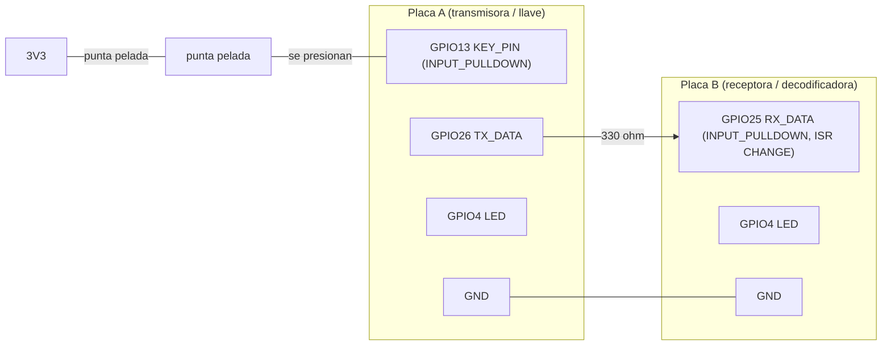

# Práctica: clave Morse táctil entre dos ESP32

Un operador teclea Morse en la **placa A** presionando dos puntas de jumper peladas
una contra otra (llave táctil). La placa A transmite ese nivel **en vivo** a la
**placa B** por el mismo cable que N1. La placa B mide duraciones, arma puntos y
rayas, decodifica letras y las imprime **como texto y como su byte ASCII en
binario** por el monitor serie. Serie a **115200** baudios.

Es independiente de `../enlace-digital/` (N1–N3; solo existe en el repositorio completo y **no hace falta para replicar esto**) y
**no toca esos archivos**: sólo reutiliza sus reglas eléctricas (GND común, `INPUT_PULLDOWN`, 330 Ω, GPIO12
prohibido) y su cable A→B. El contrato exacto de pines, temporización, tabla y
formato de salida está en [`SPEC-MORSE.md`](SPEC-MORSE.md).

> **A siempre es la transmisora / llave (`/dev/ttyUSB0`); B siempre la receptora /
> decodificadora (`/dev/ttyUSB1`).** Es la misma convención que N1 y está fijada
> aquí una sola vez.

```
clave-morse/
├── INFORME.md                    informe completo para replicar la práctica (empieza aquí)
├── PROMPT-otro-agente.md         prompt autocontenido para que otro agente de Claude Code la reproduzca en otra computadora
├── SPEC-MORSE.md                 contrato (pines, umbrales, tabla, formato de salida)
├── README.md                     este archivo
├── transmisor/transmisor.ino     placa A: llave + antirrebote, espeja a TX_DATA
├── receptor/receptor.ino         placa B: ISR + máquina de estados + decodificador
├── docs/circuito.svg             diagrama del circuito
├── visor/index.html              interfaz gráfica: traducción, circuito EN VIVO, evidencia y conexión (abrir en el navegador)
├── herramientas/captura_serie.py capturador de serie con canal de comandos (el usado para la evidencia; multiplataforma)
├── herramientas/puente_serie.py  puente placas -> navegador: pestaña «En vivo» del visor (--demo sin hardware; --log-a/--log-b para registrar evidencia; --reproducir-a/-b para repetir logs; --duplex para ../morse-duplex)
├── tests/                        pruebas sin hardware: run_tests.py, replay_evidencia.py (placa real vs sketch vs visor) y test_puente.py
└── evidencia/                    logs reales de las pruebas en banco
```

> Arduino exige que la carpeta se llame igual que el `.ino`. No renombres.

---

## Pines

| Señal | Placa | GPIO | Modo | Nota |
|---|---|---|---|---|
| `KEY_PIN` (llave) | A | 13 | `INPUT_PULLDOWN` | una punta de jumper aquí, la otra a **3V3** |
| `TX_DATA` | A | 26 | `OUTPUT` | espeja la llave (filtrada) hacia B |
| `RX_DATA` | B | 25 | `INPUT_PULLDOWN` | el de N1 |
| LED testigo | A y B | 4 | `OUTPUT` | A: estado de la llave; B: nivel crudo recibido |
| GND | A↔B | — | — | puente **obligatorio** |

25 y 26 son los pines y **el cable físico de N1**; 27 y 14 (N3) no se usan. Si N1
sigue montado, sólo hay que añadir la llave en A. **GPIO12 prohibido.**

## Conexión



```
   3V3 ──[punta pelada]╮
                       ├─ se presionan una contra otra (metal con metal)
   GPIO13 ─[punta pelada]╯          (opcional: 330 Ω en serie con la llave)

   A.GPIO26 ──[330Ω]──────────────► B.GPIO25
   A.GND ─────────────────────────── B.GND
   GPIO4 ─[330Ω]─LED─GND en cada placa
```

### Por qué metal contra metal y no "tocar un solo pin"

Si una punta va a 3V3 y cierras el circuito con el dedo hacia un pin con
pull-down, la piel es una resistencia variable (~1 kΩ sudada, >500 kΩ seca) en un
divisor contra el pull-down interno (~45 kΩ): el nivel cae en la zona indefinida
entre 0 y 1 y cambia con la humedad. Con dos puntas de jumper peladas presionadas
una contra otra, los dedos sólo dan la presión mecánica y el contacto eléctrico es
metal-metal (~0 Ω), como un pulsador real.

La resistencia de 330 Ω en serie con la llave es **opcional**: deja el nivel
cerrado en ≈3,27 V y evita un cortocircuito 3V3–GND por el pin si GPIO13 se
configurase como salida por error.

## Ver el circuito funcionando en tiempo real

```bash
python3 herramientas/puente_serie.py --a /dev/ttyUSB0 --b /dev/ttyUSB1     # y abrir http://127.0.0.1:8765/#vivo
python3 herramientas/puente_serie.py --demo 3                              # sin placas: repite la tanda 3 real

# visor Y evidencia a la vez (un puerto serie solo lo abre UN proceso, asi que el visor
# y captura_serie.py son excluyentes; el log sale en el formato de captura_serie.py):
python3 herramientas/puente_serie.py --a /dev/ttyUSB0 --b /dev/ttyUSB1 \
    --log-a evidencia/sesion_A.log --log-b evidencia/sesion_B.log --marcas /tmp/marcas
echo "#MARK INICIO TANDA 1" >> /tmp/marcas    # entra en los DOS logs

# reproducir cualquier par de logs ya grabados (util para revisar una sesion):
python3 herramientas/puente_serie.py --velocidad 4 \
    --reproducir-a evidencia/tanda3_A.log --reproducir-b evidencia/tanda3_B.log
```

Este mismo puente sirve a la práctica hermana
[`../morse-duplex/`](../morse-duplex/README.md) con `--duplex`: cambia el
intérprete de líneas (allí las placas no tienen rol y prefijan `RX `/`TX `), la
lista blanca de comandos y el visor que sirve. El modo por defecto —el de esta
práctica— no cambia en nada.

El puente lee las dos placas y le manda los eventos al navegador (un HTML no puede leer el puerto serie en Firefox). La pestaña
**2 · En vivo** muestra la llave de A, la señal, el último símbolo de B y **la traducción que imprime B** con el byte de cada letra.
Detalles, seguridad y límites: `INFORME.md` §6.6. La pestaña «Teclear» del visor es solo un simulador con el teclado.

## Cómo funciona

- **A (`transmisor.ino`)**: `loop()` sin `delay()` ni interrupciones. Lee
  `KEY_PIN`, aplica **antirrebote** (un cambio sólo se acepta si la lectura se
  mantiene `debounce_ms` = 15 ms) y lo escribe en `TX_DATA` y en el LED. Cada
  flanco sale con el mismo retardo, así que las duraciones que ve B no cambian.
- **B (`receptor.ino`)**: como N2, `attachInterrupt(RX_DATA, CHANGE)`. La **ISR**
  sólo sella `micros()`, lee el nivel de `GPIO.in` y encola el flanco en un buffer
  de 64: **no imprime ni decodifica**. `loop()` drena el buffer:
  subida → `t_subida`; bajada → duración → `.` si `< punto_raya_ms`, `-` si no
  (se imprime al decidirlo); silencio `>= letra_ms` → letra + byte en binario;
  silencio `>= palabra_ms` → `[palabra]`, **una sola vez** (bandera de "ya
  reportado").

## Procedimiento

Todos los comandos, desde la raíz del repo. Puertos de ejemplo: A = `ttyUSB0`,
B = `ttyUSB1` (confírmalos con `arduino-cli board list` y con etiquetas físicas:
las dos placas son CP2102 idénticas).

```bash
FQBN=esp32:esp32:esp32
D=bench/practicas/clave-morse
arduino-cli compile --fqbn $FQBN $D/transmisor
arduino-cli upload  --fqbn $FQBN -p /dev/ttyUSB0 $D/transmisor     # placa A (llave)
arduino-cli compile --fqbn $FQBN $D/receptor
arduino-cli upload  --fqbn $FQBN -p /dev/ttyUSB1 $D/receptor       # placa B (decodificador)
arduino-cli monitor -p /dev/ttyUSB1 -c baudrate=115200             # ver el texto decodificado
```

Abre el capturador **antes** de teclear y no lo cierres hasta terminar.

**Debe verse en B** al teclear `SOS` (S = 3 puntos, O = 3 rayas, S = 3 puntos):

```
.
.
.
[letra: S] [bin: 01010011]
-
-
-
[letra: O] [bin: 01001111]
.
.
.
[letra: S] [bin: 01010011]
[palabra]
```

### Comandos de una letra (por serie, terminados en `\n`)

| Comando | Placa | Efecto |
|---|---|---|
| `p<ms>` | B | fija `punto_raya_ms` (por defecto 300) |
| `l<ms>` | B | fija `letra_ms` (700); rechazado si no es menor que `palabra_ms` |
| `w<ms>` | B | fija `palabra_ms` (1800); rechazado si no es mayor que `letra_ms` |
| `d<ms>` | A y B | fija el antirrebote (15); `d0` lo desactiva (contraste) |
| `v` | B | alterna verbose: `# pulso_ms=…` y `# silencio_ms=…` para calibrar con datos reales |
| `c` | A y B | contadores a cero |
| `r` | A y B | imprime umbrales y contadores |

### Calibración

Los valores de arranque (300 / 700 / 1800 / 15 ms) **no son medidos**: son un
punto de partida. Activa `v`, teclea con el operador real y ajusta `p`, `l`, `w`
con las duraciones que salgan. El README debe recoger los umbrales **finales** y
el tiempo de toque real, no un valor de manual.

### Prueba de rebote

Anota a mano cuántos toques das (cada toque = 2 flancos). Con `c` a cero en las
dos placas, teclea, y compara `flancos_crudos` de B (`r`) con `2 × toques`.
Si no coinciden, el antirrebote está mal calibrado: es un hallazgo. Contraste
opcional: `d0` en A deja pasar los rebotes.

---

## Resultados

**MEDIDO EN HARDWARE el 2026-09-21** (`arduino-cli` 1.5.1, core `esp32:esp32` 3.3.11).
A = `/dev/ttyUSB0` (transmisor, llave en GPIO13 **sin** 330 Ω en serie), B =
`/dev/ttyUSB1` (receptor); el cable de señal y el GND son los de N1 (330 Ω en la
señal). **Un solo operador** (quien montó el banco), a mano. Longitud del cable:
no medida. Verbose activo en B durante toda la sesión (`# pulso_ms`, `# silencio_ms`).

### `SOS` × 3, cuatro tandas

Cada tanda son 3 `SOS` seguidos (27 toques esperados). Los umbrales se ajustaron
entre tandas con los comandos `p`/`l`/`w`/`d`, con el dato que los justifica.

| Tanda | Umbrales (B: `p`/`l`/`w`/`d`; A: `d`) | Toques dados | Pulsos que midió B | `SOS` correctos | Qué salió |
|---|---|---|---|---|---|
| 1 | 300 / 700 / 1800 / 15; A 15 | **no se sabe** | 31 (25 pt, 6 rayas) | **0 de 3** | `S` bien 4 veces; `O` fundida con la `S` siguiente (`[?] .--...`, `...---..+`) o leída como `U` |
| 2 | 140 / 700 / 1800 / 15; A 15 | 27 | 28 (19 pt, 9 rayas) | **0 de 3** | `O` partida en `M`+`T` o `T T T`; una `S` salió `H` |
| 3 | 170 / 930 / 3000 / 15; A 25 | 27 | 27 (18 pt, 9 rayas) | **2 de 3** (letras); 1 de 3 con el formato exacto | ver abajo |
| 4 | 170 / 930 / 3000 / 15; A 25 (**congelados**) | **no se sabe** (el operador admite «un par de errores») | 24 (11 pt, 13 rayas) | **0 de 3** | `S T M S` · `O S` · `O O U` (ver abajo) |

Letras decodificadas en la tanda 3 (**resumen**; el log literal, con los símbolos `.`/`-`
y el binario de cada letra, está en `evidencia/tanda3_B.log`):

```
S O S [palabra]        <- SOS #1: correcto, con separador
S O S                  <- SOS #2: letras correctas, sin [palabra]
S T M S [palabra]      <- SOS #3: la 'O' se partió en 'T' + 'M'
```

Las tres letras de un `SOS` correcto, tal como las imprimió B (líneas literales del log):

```
[letra: S] [bin: 01010011]
[letra: O] [bin: 01001111]
[letra: S] [bin: 01010011]
```

**Por qué fallaron los dos casos de la tanda 3** (datos del log, `# silencio_ms`):
- **SOS #2 sin `[palabra]`:** el hueco hasta el SOS #3 fue de **2467 ms**, menor que
  `palabra_ms=3000`. Se pidió más de 3,5 s: no fue un fallo del decodificador.
- **SOS #3, `O` partida:** el hueco entre la primera y la segunda raya fue de
  **1037 ms**, mayor que `letra_ms=930`; el resto de la `O` salió como `M`. Se pidió
  menos de ~0,8 s entre rayas.

Ambos fallos son de ritmo del operador frente a un umbral fijo, no un fallo de
la máquina de estados (las duraciones medidas por B coinciden con los flancos que
aceptó A, ver "Integridad del enlace").

**Tanda 4 (umbrales congelados, repetición de la evaluación)** — no se reproduce el 2 de 3:
- **SOS #1:** la pausa entre la primera y la segunda raya de la `O` fue de **1001 ms**, mayor que
  `letra_ms=930`: la `O` salió `T`+`M`, el mismo fallo que en la tanda 3 (allí 1037 ms). Las
  rayas de este operador llegaron a 973 ms.
- **SOS #2:** salió `O S`: falta la primera `S`. B midió 24 pulsos frente a 27 esperados, exactamente
  3 menos, y el operador admite haber cometido errores. Es un error de tecleo, no del decodificador
  (no se puede confirmar qué quiso teclear, solo que coincide con la cuenta).
- **SOS #3:** salió `O O U` (la `U` son dos puntos de 131 y 99 ms y una raya de 305 ms). No se sabe qué se quiso teclear.
- **Con los umbrales congelados (tandas 3 y 4): 6 `SOS` intentados, 2 correctos** (ambos de la tanda 3).
  De los 4 fallos: 2 por una pausa entre rayas mayor que `l` (1037 y 1001 ms), 1 por el hueco entre SOS menor
  que `w` (2467 ms; las letras eran correctas) y 2 por errores de tecleo del operador.
- **Enlace A→B:** A aceptó 48 flancos y B contó 48 (`aceptados` sale del resumen periódico y de las 48
  líneas de flanco legibles, porque el `r` final de A llegó corrupto por la basura de captura).

### Umbrales usados al final (y por qué)

Se **aplicaron por serie y no están guardados en el firmware**: tras un reset B
vuelve a 300/700/1800/15 y A a 15. Son de **este operador**, no un valor de manual.

| Parámetro | Arranque → final | Dato que lo justifica |
|---|---|---|
| `punto_raya_ms` (B) | 300 → **170** | Pulsos cortos ≤ 129 ms y largos ≥ 210 ms en las tandas 1 y 2; punto medio. En la tanda 1, 6 de 12 rayas medían 210–276 ms y con 300 se leían como puntos. |
| `letra_ms` (B) | 700 → **930** | Tanda 2: pausas dentro de una letra hasta 852 ms; entre letras desde 1011 ms. |
| `palabra_ms` (B) | 1800 → **3000** | Tanda 2: pausas entre letras hasta 2203 ms; entre palabras desde 3818 ms. |
| `debounce_ms` (A) | 15 → **25** | Tanda 2: un toque dio **dos pulsos** con un hueco de 19 ms que los 15 ms no filtraron (la `S` salió como `H`). |
| `debounce_ms` (B) | 15 (sin cambios) | `filtrados=0` en las cuatro tandas: B nunca descartó un pulso. |

**Advertencias:**
- Los márgenes de `letra_ms` son de ~78 ms por abajo y ~81 ms por arriba: **estrechos**.
  Se calibró con las tandas 1–2 y se evaluó en la 3 (un solo conjunto de 3 `SOS`, sin repetir).
- En la tanda 1 hubo pausas entre letras de 396–586 ms; con `letra_ms=930` volverían a
  fundir letras. **El decodificador no es robusto a un cambio de cadencia del operador.**
- `debounce_ms=25` queda muy cerca del pulso más corto visto en la tanda 1 (26 ms). No se
  sabe si eran toques reales; en las tandas 2 y 3 el más corto fue de 36 ms.

### Tiempo de toque de una persona real (medido por B, verbose)

| Tanda | Puntos (ms) | Rayas (ms) |
|---|---|---|
| 1 | 26–69 (n=19) | 210–491 (n=12) |
| 2 | 36–129 (n=19) | 570–721 (n=9) |
| 3 | 95–140 (n=18) | 368–644 (n=9) |
| 4 | 68–131 (n=11) | 220–973 (n=13) |

**El mismo operador cambió de ritmo entre tandas** (las rayas de la tanda 2 son ~2× las de
la 1). Por eso los umbrales de una sesión no se pueden dar por buenos en la siguiente.

### Prueba de rebote: toques reales frente a flancos

Cada toque son 2 flancos. `crudos (pin)` son los cambios de lectura de GPIO13 en A
**antes** del antirrebote.

| Tanda | `d` de A | Toques | Flancos esperados | `crudos (pin)` A | `aceptados` A | `flancos_crudos` B | Pulsos en B |
|---|---|---|---|---|---|---|---|
| 1 | 15 | no se sabe | — | 150 | 62 | 62 | 31 |
| 2 | 15 | 27 | 54 | 298 | 56 | 56 | 28 |
| 3 | 25 | 27 | 54 | 134 | 54 | **55** | 27 |
| 4 | 25 | no se sabe | — | 90 | 48 | 48 | 24 |

- **Hay rebote real y el antirrebote lo absorbe casi todo:** 298 cambios crudos en el pin
  dieron 56 flancos aceptados (tanda 2) y 134 dieron 54 (tanda 3).
- **Con `d=15` no bastó:** en la tanda 2, 27 toques dieron 28 pulsos. Un toque se partió en
  `48 ms` + hueco de `19 ms` + `37 ms` (flancos de A `524109→524157`, `524176→524213`).
  Es un **hallazgo**: el rebote de esta llave a veces dura más de 15 ms.
- **Con `d=25`, en la tanda 3, 27 toques dieron 27 pulsos.** Una sola tanda: no prueba que
  25 ms sea suficiente siempre.
- **Tandas 1 y 4: indeterminables** (el operador no sabe cuántos toques dio).
- **Integridad del enlace A→B:** tandas 1, 2 y 4, `aceptados` de A = `flancos_crudos` de B
  (62 = 62, 56 = 56, 48 = 48), `filtrados=0`, `desbordes_buffer=0`, `niveles_repetidos=0`: no se
  perdió ningún flanco. En la tanda 3, B contó **55** entradas de ISR frente a 54 aceptados
  por A, con `niveles_repetidos=1`: una activación de la ISR sin cambio de nivel, ignorada
  por la máquina de estados. **Causa no determinada** (hipótesis: un glitch de la línea más
  corto que la latencia de la ISR; no se midió con instrumento).

### Segunda sesión: Windows, otro operador (2026-09-21)

Réplica independiente en **Windows 11** (`arduino-cli` 1.5.1, core `esp32:esp32` 3.3.11, los
mismos del banco de Linux), con **otro operador** y **las mismas dos placas**. Puertos
`COM5` (A) y `COM7` (B); aquí no hay `/dev/ttyUSB*`. Evidencia en `sesion_win_{A,B}.log` y
`win_tanda{1,2,3}_{A,B}.log`.

| Tanda | Umbrales (B: `p`/`l`/`w`; A: `d`) | `SOS` intentados | Correctos | Qué salió |
|---|---|---|---|---|
| 1 (calibración) | 300 / 700 / 1800; A 15 | 3 | **1** | `S E I` · `S E O S` · **`S O S`** |
| 2 (evaluación) | 300 / 700 / **2400**; A **25** | 6 grupos | **6** `S O S` seguidos | 1 con `[palabra]` limpio |
| 3 (final) | **173** / 700 / 2400; A 25 | 4 | **3** | `S O S` · `S J S` · `S O S` · `S O S`, los tres con `[palabra]` |

**Tanda 3, cada pulso justificado.** El operador declaró haberse equivocado en un `SOS`
(tecleó `SJS`). La cuenta esperada a partir de las letras decodificadas coincide **exactamente**
con los contadores de la placa:

| | Puntos | Rayas |
|---|---|---|
| 3 × `SOS` | 18 | 9 |
| 1 × `SJS` (`J` = `.---`) | 7 | 3 |
| **Esperado** | **25** | **12** |
| **Contado por B** | **25** | **12** |

**Prueba de rebote completa** (lo que quedó *indeterminable* en las tandas 1 y 4 de Linux):
37 toques → 74 flancos esperados; **A aceptó 74 y B contó 74**, con `filtrados=0`,
`desbordes_buffer=0` y `niveles_repetidos=0`. El antirrebote absorbió **210 cambios crudos
del pin hasta dejar 74 flancos exactos**, sin perder ni colar ninguno. Con `d=15` se había
colado un rebote de **23 ms**; con `d=25` no hay **ningún** hueco por debajo de 60 ms.

**`punto_raya_ms = 173` sale de una banda vacía medida, no de un punto medio inventado.**
En la tanda 3 los 25 puntos caen en **38–135 ms** y las 12 rayas en **266–399 ms**: entre
135 y 266 no hay **ni un solo pulso**, 131 ms de separación limpia. Antes, con `p=300`, el
umbral caía *dentro* de las rayas del operador: 8 intentos de raya se quedaron en 212–292 ms
y se leyeron como puntos, y otros 10 entraron por los pelos entre 300 y 359 ms. El operador
lo describió como «cuesta más crear la raya» **antes** de ver los números.

> El operador de Linux calibró a **170** y el de Windows a **173**, por caminos
> independientes. Dos personas, dos máquinas, el mismo umbral: apunta a que ese valor es una
> propiedad **de la llave de puntas de jumper**, no del operador. El informe de Linux lo
> atribuía al operador (§8.2). **No está comprobado con una tercera llave.**

**Limitaciones de esta sesión:**
- **Una sola tanda por configuración, y los umbrales se cambiaron entre tandas.** El 3 de 4
  **no se repitió con los umbrales congelados**, que es justo lo que tumbó el 2 de 3 de Linux.
  No es una tasa de acierto.
- **En las tandas 1 y 2 no se contaron los toques**, así que ahí la prueba de rebote tampoco
  se puede cerrar. Solo la tanda 3 tiene el dato.
- `p=173` se calibró y se evaluó **en la misma tanda**: el umbral sale de los pulsos que
  luego se usan para juzgarlo. Falta una tanda independiente que lo valide.
- **No se reprodujo la basura de captura** (bloques de 64 bytes `0xFF`) en ninguna de las
  tres tandas. Se había desactivado la suspensión selectiva de USB antes de empezar, pero
  **no se probó a dejarla activada**: no se puede afirmar que sea la causa.

### Evidencia (`evidencia/`)

**Sesión de Windows (2026-09-21):** `sesion_win_{A,B}.log` (sesión completa con `#MARK` y los
comandos `>>>`) y los extractos `win_tanda1_{A,B}.log` (calibración), `win_tanda2_{A,B}.log`
(evaluación) y `win_tanda3_{A,B}.log` (final, la de `p=173`).

**Sesión de Linux:** `sesion_A.log`, `sesion_B.log` (toda la sesión, con `#MARK` de inicio/fin de cada tanda y los
comandos enviados marcados `>>>`), y los extractos `tanda1_{A,B}.log`, `tanda2_{A,B}.log`,
`tanda3_{A,B}.log`. La **tanda 4** son capturas completas: `tanda4_{A,B}.log` (incluyen la marca
`#MARK ANOMALIA` de abajo antes de `INICIO TANDA 4`). **`tanda4_A.log` pesa ≈783 KB** porque sus primeras 23 672
líneas son basura de captura (el mismo fragmento repetido durante ≈3 s, ≈260 KB/s, imposible por una UART a 115200);
se conserva sin modificar. Ver `INFORME.md` §8.6.

### Limitaciones y hallazgos abiertos

- **Un solo operador y cuatro tandas.** El 2 de 3 de la tanda 3 **no se reprodujo** en la 4 (0 de 3); con los umbrales
  congelados salen 2 de 6. Ninguna de las dos cifras es una tasa de acierto.
- **Anomalía sin explicar antes de la tanda 4:** entre el cierre de la sesión y la reapertura de los capturadores (sin
  registro), A pasó de 54 a 62 flancos aceptados (+8) y B de 55 a 57 `flancos_crudos` (+2). Alguien tocó la llave o el
  cableado en ese intervalo; **no se sabe qué**, y no hay log de esos toques. Los contadores se pusieron a cero antes de la
  tanda 4, donde el enlace volvió a ser fiel (48 = 48).
- **Basura de captura serie**, la misma que en N1: bloques de 64 bytes `0xFF` pisan el principio de
  alguna línea del log (p. ej. en `tanda3_B.log` antes del primer `.`). Causa no encontrada. No afecta
  a la decodificación: sale de la ISR y la máquina de estados, no del log.
- Antes de la tanda 1 hubo un ensayo informal con la llave (`crudos=135 aceptados=39` en A);
  se puso a cero y **no cuenta** como medida.
- **No medido:** temporización de la ISR, GPIO14/reloj (no se usa), longitud del cable,
  cualquier medida con instrumento.
- Los logs de `evidencia/` **sí se versionan**: aunque `.gitignore:36` ignora `*.log`, la
  línea 38 (`!bench/practicas/*/evidencia/*.log`) los vuelve a incluir a propósito, y
  `git ls-files` los lista. *(Antes este punto afirmaba lo contrario; era falso.)*

## Estado de verificación

- **Compilación real: OK.** `arduino-cli` 1.5.1, core `esp32:esp32` 3.3.11,
  `--fqbn esp32:esp32:esp32 --warnings all`: `transmisor` 273 256 B y `receptor`
  277 240 B de programa, sin errores ni advertencias.
- **Lógica verificada en el host (mock del core), no en placa:**
  `python3 bench/practicas/clave-morse/tests/run_tests.py` compila con
  ASan/UBSan los `.ino` **reales** y comprueba `SOS` (salida exacta y `[palabra]`
  una sola vez), la tabla A–Z/0–9 (36 entradas) contra un diccionario Morse
  independiente, los umbrales (299 ms = punto, 300 ms = raya), el filtro de
  ruido, el desbordamiento del buffer de flancos, los rechazos de comandos y el
  antirrebote del transmisor. Se comprobó con mutaciones (quitar la bandera de
  `[palabra]`, romper la entrada `S`, quitar los ceros a la izquierda del
  binario) que estos tests fallan cuando deben. **Forma parte de `make check`**
  (objetivo `bench-test`), junto con `test_puente.py` y las de `../morse-duplex/`.
- **Verificado en hardware el 2026-09-21** (ver `## Resultados`): el enlace A→B
  transmite la llave sin perder flancos y B decodifica; con umbrales calibrados con
  el operador, **2 de 3 `SOS` salieron bien en la tanda 3, pero 0 de 3 en la tanda 4 con los mismos
  umbrales**. No es una tasa de acierto: un operador, 4 tandas. El test de host sólo prueba la **lógica**.
  **Sin medir:** latencia de la ISR y cualquier cosa que requiera instrumento.
- **Replicado en Windows 11 el 2026-09-21, con otro operador y las mismas placas**
  (ver «Segunda sesión» en `## Resultados`): compila y sube con el mismo
  `arduino-cli` 1.5.1 y core 3.3.11 (`transmisor` 273 272 B, `receptor` 277 256 B;
  los 16 B de diferencia con Linux son la ruta del sketch embebida). `run_tests.py`,
  `replay_evidencia.py` y `test_puente.py` **pasan enteros**, sin necesitar ningún
  parche, una vez hay un `g++` en el `PATH`. En hardware: **3 de 4 `SOS` en la tanda
  final**, con el enlace A→B fiel (74 = 74) y la **prueba de rebote completa**. Sigue
  sin ser una tasa de acierto: una tanda por configuración, sin repetir con umbrales
  congelados.
- **Las dos herramientas de captura se arreglaron a raíz de esa sesión:**
  `captura_serie.py` es ahora **multiplataforma** (FIFO en POSIX, fichero al que se
  apendean líneas en Windows, que no tiene FIFOs; el log es idéntico en los dos), y
  `puente_serie.py` sabe **escribir el log** (`--log-a`, `--log-b`, `--marcas`). Esto
  último hace falta porque un puerto serie sólo lo abre **un** proceso: sin ello, ver el
  visor en vivo y capturar evidencia son excluyentes. **Sin probar:** la rama POSIX de
  `captura_serie.py` no se ha ejecutado en Linux tras el cambio.
- El cableado de N1 se reutiliza, pero **subir esta práctica sustituye el sketch
  de N1** en las dos placas: no pueden correr las dos a la vez.
