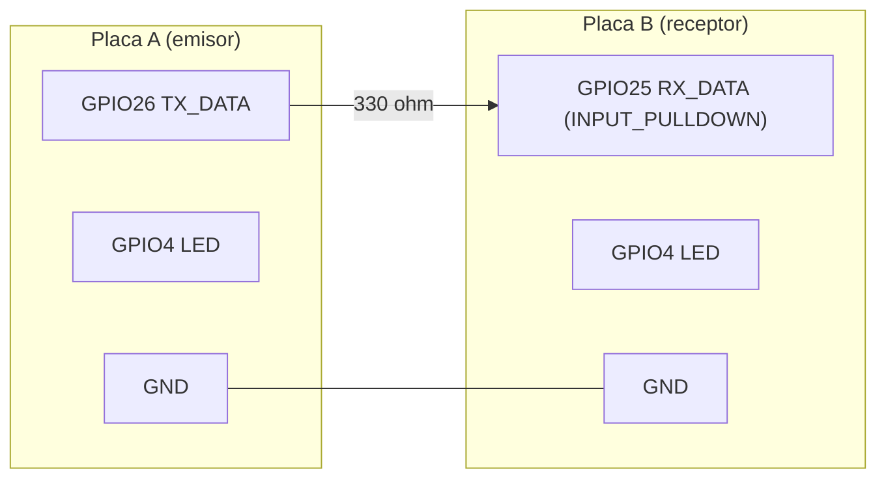
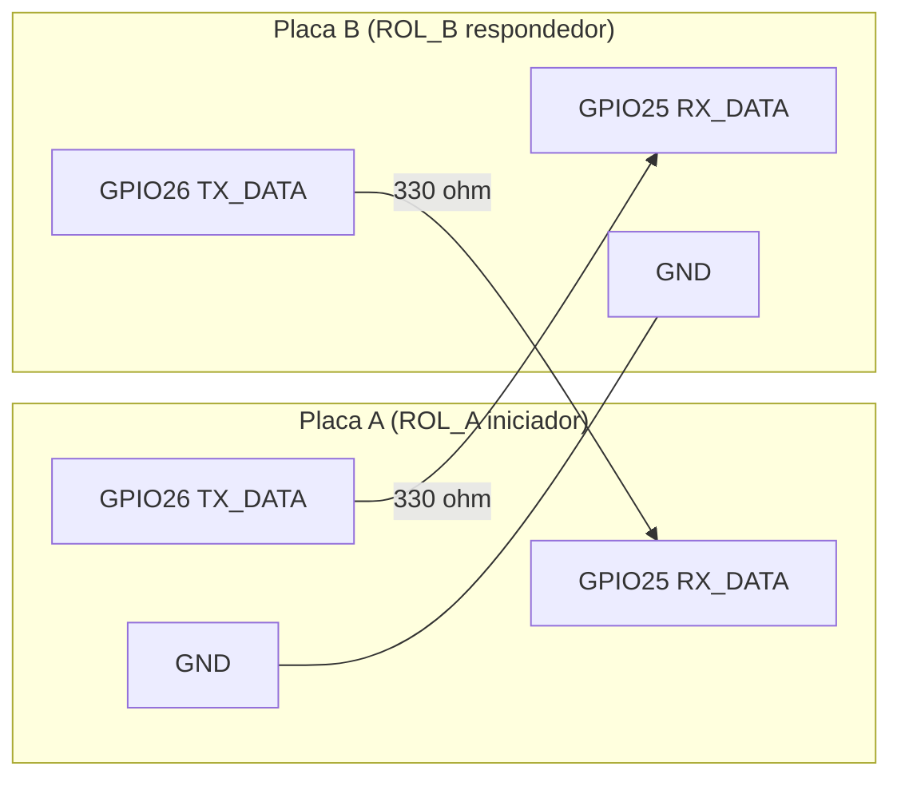
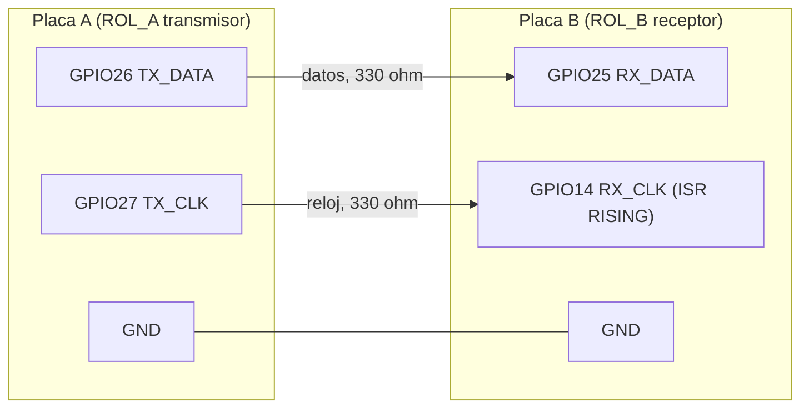

# Práctica: enlace digital entre dos ESP32

Dos placas ESP32 WROOM que "se intercomunican" con entradas y salidas
digitales, en tres niveles de dificultad. Los sketches son **Arduino
autocontenidos** (sólo dependen del core `esp32:esp32`), están comentados en
español y las dos placas cargan **el mismo firmware**: sólo cambia una
constante de rol. Serie a **115200** baudios.

El contrato exacto de pines, trama, CRC-8, generador de payload y vectores de
prueba está en [`SPEC-LINK.md`](SPEC-LINK.md) (esto **no** es el protocolo ENLP
del monorepo: es lo que dos nodos se dicen por un cable).

```
enlace-digital/
├── SPEC-LINK.md                    contrato (pines, trama, CRC, vectores)
├── README.md                       este archivo
├── n1_nivel/emisor/emisor.ino      N1: espejo de estado de 1 bit (placa A)
├── n1_nivel/receptor/receptor.ino  N1: espejo de estado de 1 bit (placa B)
├── n2_handshake/n2_handshake.ino   N2: handshake y RTT (ROL_A / ROL_B)
├── n3_bytes/n3_bytes.ino           N3: enlace síncrono con reloj, CRC y BER (ROL_A / ROL_B)
└── tests/                          test de host de N3 (`make bench-test`): mock, harness C++, driver Python
```

> Arduino exige que la carpeta se llame igual que el `.ino`. No renombres.

---

## Pines (todas las placas iguales)

| Señal | GPIO | Modo | Usada en |
|---|---|---|---|
| `TX_DATA` | 26 | `OUTPUT` | N1, N2, N3 |
| `RX_DATA` | 25 | `INPUT_PULLDOWN` | N1, N2, N3 |
| `TX_CLK` | 27 | `OUTPUT` | sólo N3 |
| `RX_CLK` | 14 | `INPUT_PULLDOWN` | sólo N3 |
| LED testigo | 4 | `OUTPUT` | N1 (LED externo + 330 Ω a GND; `LED_PIN 2` = LED on-board) |
| GND | GND | — | puente **obligatorio** entre placas |

Los cuatro pines de señal están por debajo de 32, requisito para escribirlos
con `GPIO.out_w1ts` / `GPIO.out_w1tc` en N2 y N3.

> ## ADVERTENCIA: NUNCA uses GPIO12
>
> GPIO12 es el pin de *strapping* **MTDI**: el ESP32 lo lee **durante el
> arranque** para decidir la tensión de la memoria flash (3.3 V o 1.8 V). Si
> hay un nivel alto en GPIO12 en el reset (un cable al otro ESP32, un LED, una
> entrada activa), la placa puede **no arrancar** o arrancar con la flash mal
> alimentada, y el síntoma es desconcertante ("a veces funciona"). El código
> original de la práctica lo usaba. Aquí está prohibido; también se evitan
> GPIO0, 2, 5 y 15 (strapping/arranque) y GPIO6–11 (conectados a la flash).

---

## Conexión

### N1: espejo de estado (3 cables)



### N2: handshake bidireccional (cableado cruzado, 4 cables)



### N3: enlace síncrono de dos hilos + GND (un sentido)



## Reglas eléctricas

1. **GND común, siempre.** Un nivel lógico es una tensión *respecto a una
   referencia*. Sin el cable de GND entre las placas, el receptor no tiene
   contra qué medir "3.3 V". Puede parecer que funciona (acoplo capacitivo,
   el USB del PC como referencia común) y fallar al mover un cable.
2. **Nunca unir dos salidas.** Cada salida (`TX_*`) va a una **entrada**
   (`RX_*`) de la otra placa. Dos salidas unidas con niveles opuestos son un
   cortocircuito entre ellas.
3. **330 Ω en serie en cada línea de señal.** Limita la corriente si por error
   se cruzan dos salidas, o si se conecta con la otra placa aún arrancando.
   GPIO14 emite un pulso PWM durante el arranque del ESP32, otro motivo para
   la resistencia.
4. **3.3 V directo, sin level shifter.** Las dos placas son ESP32 (3.3 V); un
   conversor de nivel no hace falta y sólo añade retardo.
5. **Entradas con `INPUT_PULLDOWN`**, nunca flotantes.
6. Cables cortos (< 30 cm) para N3 a velocidades altas.

---

## Qué estaba mal en el código original

| # | Falla del original | Por qué es un problema | Corrección |
|---|---|---|---|
| 1 | **Sin enlace físico**: no hay cable de señal definido entre las placas | Sin conductor entre `TX` de una y `RX` de la otra no hay comunicación posible, sea cual sea el software | Cableado explícito por nivel (diagramas de arriba); 330 Ω en serie |
| 2 | **Sin GND común** | Sin referencia compartida, el nivel lógico que ve el receptor es indeterminado | Puente de GND obligatorio, repetido en la cabecera de cada sketch |
| 3 | **Entrada `INPUT` sin pull** (flotante) | Una entrada flotante **no es un 0**: lee ruido (mano, cable, red eléctrica). Ningún `delay()` lo arregla | `INPUT_PULLDOWN` en `RX_DATA`/`RX_CLK`; el receptor N1 documenta cómo probarlo (desconectar el cable de señal: debe quedar en 0 estable) |
| 4 | **GPIO12** (strapping MTDI) | Un nivel alto en el reset selecciona mal la tensión de la flash: la placa puede no arrancar | Prohibido; pines 26/25/27/14/4 |
| 5 | **9600 baudios** en el serie del sketch, frente a los 115200 que usa el resto del banco | Con velocidades distintas la consola muestra basura; no es un problema del enlace sino de la observación | Serie a 115200 en **todos** los sketches |
| 6 | **Onda de 1 Hz / 100 ms**: sirve para *ver un nivel*, no para transmitir datos | Un espejo de 1 bit a 1 Hz sólo demuestra que el cable existe; no hay noción de byte, velocidad ni error | N1 mantiene el espejo (con medición de intervalos y anomalías); N2 mide latencia; N3 transmite bytes y mide BER |
| 7 | **Sin trama, sin reloj, sin verificación** | Sin delimitador no se sabe dónde empieza un dato; sin reloj se depende de que ambos relojes coincidan; sin CRC un bit erróneo pasa inadvertido | N3: trama `0xAA \| LEN \| PAYLOAD \| CRC8`, reloj explícito, CRC-8, contabilidad de errores |

## Por qué un enlace síncrono (con reloj) y no una UART "a mano"

En una UART (asíncrona) el receptor debe contar el tiempo con **su propio
reloj** y confiar en que coincide con el del emisor: si difieren unos pocos
por ciento, los bits se corren hasta leerse mal. Implementarla *bit-bang* en
las dos placas añade jitter de software a ese problema.

En el enlace síncrono de N3 el emisor envía además una línea de **reloj** y el
receptor lee el dato **en cada flanco de subida**:

- **No depende de que los relojes coincidan.** El receptor ni siquiera necesita
  saber la velocidad; sólo la usa el transmisor.
- **Es robusto**: si el transmisor se retrasa (interrupción, `delay`), el
  reloj se estira y el receptor sigue alineado; el único requisito temporal es
  que el dato esté estable *alrededor* del flanco.
- **Se explica mejor**: "el dato vale lo que hay cuando sube el reloj".
- Coste: un cable más.

El límite de velocidad no lo pone la sincronización sino el *setup/hold*: el
dato cambia medio periodo antes/después del flanco, y la latencia de la
interrupción del receptor (unos µs) se acerca a ese medio periodo hacia
100-200 kbit/s. Encontrar ese punto es parte de la práctica.

---

## Procedimiento de prueba

Requisitos: `arduino-cli` con el core instalado (`arduino-cli core install
esp32:esp32`), dos placas ESP32 WROOM (`esp32:esp32:esp32`), cable USB a cada
una. Los puertos de abajo (`/dev/ttyUSB0` = placa A, `/dev/ttyUSB1` = placa B)
son un ejemplo; compruébalos con `arduino-cli board list`. En Linux el usuario
debe estar en el grupo `dialout`.

Todos los comandos se ejecutan desde `bench/practicas/enlace-digital/`.

**Cambio de rol (N2 y N3).** El rol es una línea del propio sketch: deja
activa **sólo una** de `#define ROL_A` / `#define ROL_B` (con las dos, o
ninguna, no compila: hay un `#error`). Para no tocar el original, se genera
una copia para la placa B (la carpeta debe llamarse igual que el `.ino`):

```bash
# N2, placa B
mkdir -p /tmp/n2_rolb && sed 's|^#define ROL_A|// #define ROL_A|; s|^// #define ROL_B|#define ROL_B|' \
  n2_handshake/n2_handshake.ino > /tmp/n2_rolb/n2_rolb.ino
# N3, placa B
mkdir -p /tmp/n3_rolb && sed 's|^#define ROL_A.*|// #define ROL_A|; s|^// #define ROL_B.*|#define ROL_B|' \
  n3_bytes/n3_bytes.ino > /tmp/n3_rolb/n3_rolb.ino
```

### N1: espejo de estado

**Cablear:** `A.GPIO26 → (330 Ω) → B.GPIO25` y `A.GND → B.GND`. LED con 330 Ω en
GPIO4 de cada placa (o `LED_PIN 2`).

```bash
FQBN=esp32:esp32:esp32
arduino-cli compile --fqbn $FQBN n1_nivel/emisor
arduino-cli upload  --fqbn $FQBN -p /dev/ttyUSB0 n1_nivel/emisor      # placa A
arduino-cli compile --fqbn $FQBN n1_nivel/receptor
arduino-cli upload  --fqbn $FQBN -p /dev/ttyUSB1 n1_nivel/receptor    # placa B
arduino-cli monitor -p /dev/ttyUSB1 -c baudrate=115200                 # ver el receptor
```

**Debe verse:** los dos LED parpadean a la vez (1 Hz). El receptor imprime
`t_ms,nivel_rx,dt_ms` con `dt_ms` ≈ 500 en cada cambio, sin `ANOMALIA`, y cada
5 s una línea `# resumen ... cambios=... anomalias=...`.

**Prueba de la entrada flotante:** con todo funcionando, **desconecta el cable
de señal** (deja el GND). El receptor debe quedarse en **0 estable**: LED
apagado, sin más líneas de cambio. (Con `INPUT` sin pull, esto mismo produce
cambios aleatorios.) Al reconectar vuelve a seguir al emisor.

### N2: handshake y RTT

**Cablear (cruzado):** `A.GPIO26 → (330 Ω) → B.GPIO25`, `B.GPIO26 → (330 Ω) →
A.GPIO25`, `A.GND → B.GND`. No unir 26 con 26.

```bash
FQBN=esp32:esp32:esp32
arduino-cli compile --fqbn $FQBN n2_handshake                                  # ROL_A (por defecto)
arduino-cli upload  --fqbn $FQBN -p /dev/ttyUSB0 n2_handshake                  # placa A
arduino-cli compile --fqbn $FQBN /tmp/n2_rolb
arduino-cli upload  --fqbn $FQBN -p /dev/ttyUSB1 /tmp/n2_rolb                  # placa B (ROL_B)
arduino-cli monitor -p /dev/ttyUSB0 -c baudrate=115200
```

Arranca primero la placa B (o pulsa reset en A al final).

**Debe verse:** cabecera `seq,rtt_us,timeouts` y una línea por intercambio. Tras
1000 intercambios exitosos, líneas `#` con `n,min,max,media,desv_est,timeouts` y
un histograma de 10 cubetas. Envía `r` por serie para repetir la tanda. La
placa B imprime `# B flancos_atendidos=N` cada 5 s (N crece 2 por intercambio).
Con el cable de respuesta desconectado, A imprime `rtt_us = -1` y avisa cada 100
intentos seguidos sin respuesta. Guarda la salida CSV para el informe:

```bash
arduino-cli monitor -p /dev/ttyUSB0 -c baudrate=115200 | tee n2_rtt.csv
```

### N3: enlace síncrono, bytes con CRC y BER

**Cablear:** `A.GPIO26 → (330 Ω) → B.GPIO25` (datos), `A.GPIO27 → (330 Ω) →
B.GPIO14` (reloj), `A.GND → B.GND`. Un solo sentido basta para medir BER.

```bash
FQBN=esp32:esp32:esp32
arduino-cli compile --fqbn $FQBN n3_bytes                                      # ROL_A transmisor
arduino-cli upload  --fqbn $FQBN -p /dev/ttyUSB0 n3_bytes                      # placa A
arduino-cli compile --fqbn $FQBN /tmp/n3_rolb
arduino-cli upload  --fqbn $FQBN -p /dev/ttyUSB1 /tmp/n3_rolb                  # placa B (ROL_B receptor)
```

Abre **dos** monitores serie a 115200 (uno por placa). Comandos de una letra
(en **ambas** placas):

| Comando | Transmisor (A) | Receptor (B) |
|---|---|---|
| `t` | inicia la prueba: 1000 tramas, `seq` 0..999 | pone a cero los contadores |
| `r` | imprime su estado | imprime el reporte |
| `+` / `-` | sube / baja la velocidad: 1000, 5000, 10000, 50000, 100000, 200000 bit/s | sólo etiqueta el reporte |
| `b<N>` | fija la velocidad a N bit/s (p. ej. `b50000`; 100..500000) | idem |

Sólo el transmisor genera el reloj, así que sólo él *necesita* la velocidad;
manda el mismo comando a las dos placas para que el reporte diga a qué
velocidad se midió.

**Secuencia por cada velocidad:** (1) fijar velocidad en A y en B, (2) `t` en
**B** (receptor a cero), (3) `t` en **A**, (4) esperar a que A imprima
`# TX fin` y B imprima su reporte (sale solo al llegar la trama 999, o a los 5
s sin tramas; también con `r`).

**Debe verse (criterio de aceptación, no medida):** a 1 kbit/s con el cableado
correcto, `frames_ok = 1000`, `frames_crc_err = 0`, `frames_len_err = 0`,
`bit_errors = 0`, `BER = 0`, `frames_perdidas = 0`. Al subir la velocidad,
anota a partir de cuál aparecen errores. Formato del reporte de B:

```
frames_ok,frames_crc_err,frames_len_err,bits_rx,bit_errors,BER,frames_perdidas
```

Definiciones (SPEC-LINK.md): `bits_rx` cuenta los bits posteriores al
sincronismo (LEN+PAYLOAD+CRC) de cada trama completada; `bit_errors` es el
popcount del XOR entre payload recibido y esperado (semilla conocida
`0xC0FFEE`, así el receptor sabe qué esperar sin canal de vuelta);
`frames_perdidas = 1000 − (frames_ok + frames_crc_err)`. Si la longitud
recibida difiere de la esperada, se comparan exactamente los `len` bytes
**recibidos** contra el payload esperado rellenado con ceros hasta 32 B, y los
bytes que faltan no se cuentan (así `bit_errors ⊆ bits_rx` y `BER ≤ 1`).

> El bus con direccionamiento (extensión opcional) **no está implementado**.

---

## Resultados N1

**PENDIENTE DE MEDIR EN HARDWARE**

| Fecha | Placas / cable | Cambios en 60 s | Anomalías | Nivel con cable de señal desconectado | Observaciones |
|---|---|---|---|---|---|
| | | | | | |

## Resultados N2

**PENDIENTE DE MEDIR EN HARDWARE**

| Fecha | Placas / cable | n | min (µs) | max (µs) | media (µs) | desv. est. (µs) | timeouts |
|---|---|---|---|---|---|---|---|
| | | | | | | | |

## Resultados N3

**PENDIENTE DE MEDIR EN HARDWARE**

| Velocidad (bit/s) | frames_ok | frames_crc_err | frames_len_err | bits_rx | bit_errors | BER | frames_perdidas |
|---|---|---|---|---|---|---|---|
| 1000 | | | | | | | |
| 5000 | | | | | | | |
| 10000 | | | | | | | |
| 50000 | | | | | | | |
| 100000 | | | | | | | |
| 200000 | | | | | | | |

---

## Estado de verificación

- **Compilación real: OK.** `arduino-cli` 1.5.1 con el core `esp32:esp32`
  3.3.11, `--fqbn esp32:esp32:esp32`: compilan sin errores ni advertencias
  (`--warnings all`) `emisor`, `receptor`, `n2_handshake` (ROL_A), `n3_bytes`
  (ROL_A) y las copias ROL_B de N2 y N3 generadas con el `sed` de arriba. Con
  ningún rol, o con los dos, el `#error` dispara con el core real (N2 y N3).
- **Test en el repo para N3: `make bench-test`** (corre también en `make check`
  y en CI). Compila con `g++` (con ASan/UBSan) un harness que hace `#include`
  del `n3_bytes.ino` **real**, sobre un mock mínimo del core Arduino
  (`tests/mock/`), y lo contrasta con `SPEC-LINK.md` (los vectores se leen del
  propio fichero) y con `LinkMonitor` de
  `gateway/espstation_gateway/transports/sim/dio_link.py`:
  1. vectores dorados: CRC-8, tramas completas y generador `seq` 0/1/2/999
     (y el generador entero, `seq` 0..999, contra `dio_link.py`);
  2. barrido de bit-flips sobre las tramas `seq` 0..999: 13 `FRAME_OK`
     espurios en 8 000 volteos de `LEN` y 0 en 139 976 de `PAYLOAD`/`CRC`;
  3. tramas pegadas cuyo CRC acaba en nibble bajo `0xA`: sin falso sincronismo;
  4. enlace TX→RX de extremo a extremo por el registro de bits simulado, a las
     seis velocidades de la lista: BER 0, periodo de reloj igual al nominal,
     dato estable medio periodo antes y después del flanco, hueco entre tramas
     ≥ 16 periodos, y el TX pone en el cable exactamente las tramas del SPEC;
  5. contra-prueba de deriva: flujos con errores aleatorios (semilla fija) por
     el sketch y por `LinkMonitor`; los 7 contadores deben coincidir exactamente.

  `make bench-test` no necesita hardware ni el core Arduino. Para comprobar
  que el test detecta deriva, `python bench/practicas/enlace-digital/tests/run_tests.py
  --mutation-check` aplica 11 mutaciones al sketch (polinomio CRC, semilla,
  regla de `bit_errors`, resincronización, orden de bits, hueco, orden de `pinMode`...) sobre copias
  temporales y exige que todas hagan fallar el test.
- **Sin verificar en hardware.** Ningún sketch se ha ejecutado en una placa;
  ninguna cifra de esta práctica está medida. El test de host prueba la
  **lógica** (trama, CRC, FSM, contabilidad, secuencia y espaciado de los
  flancos del transmisor), **no** la temporización real: latencia de la ISR,
  jitter, setup/hold en el cable y límite de velocidad son cosa del banco.
- N1 y N2 sólo se ejercitaron una vez con un mock del core y entradas simuladas
  (latencias, intervalos y respuestas perdidas inventados: sirven para comprobar
  la lógica, no son mediciones); no tienen test en el repo.
