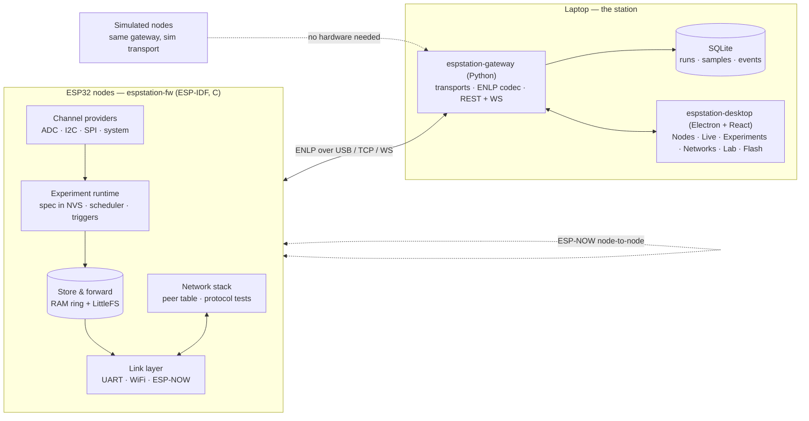

# EspStation Architecture

EspStation is a workbench for **ESP32 experiments and node networks**: you
define an experiment, push it to one or many nodes, watch them live while
they're tethered, and then **walk away with the cable unplugged** while the
nodes keep doing the job in production.

## The governing principle

> **PiStation:** the Pi is a sensor and actuator; the laptop is the brain.
> **EspStation:** the node is autonomous; the station is the laboratory.

This inversion is the whole design. On a Raspberry Pi it is fine for the
laptop to hold the logic, because the Pi is a general-purpose computer on
mains power that you administer remotely. An ESP32 is not that: it is deployed
in a field, on a battery, inside a payload, behind a mesh — usually with
nobody watching. So the experiment logic **lives on the node**, in NVS, and
survives reboots, brownouts and the absence of any station.

The station is an instrument, never a control loop. Everything it offers —
live charts, topology graphs, fault injection, analysis — is observation,
configuration and orchestration. Unplug it and nothing on the node changes
except that telemetry starts going to storage instead of to a screen.

Three consequences follow, and they drive every module below:

1. **Experiments are declarative data, not compiled code.** Changing sample
   rates, channels, triggers or duration must not require a rebuild-and-flash
   cycle — otherwise "reconfigure the fleet" becomes a day of work.
2. **Telemetry is durable at the node.** Store-and-forward with an explicit
   durability watermark, so a disconnected run loses nothing.
3. **The link is optional and lossy by assumption.** Everything is designed
   for reconnection, gaps and replay from the first line of code.

## System view

## Components

### `firmware/` — espstation-fw (ESP-IDF, C, built with PlatformIO)

One firmware, many targets (`esp32` today; `esp32s3`, `esp32c3`, `esp32c6`
are build environments in `platformio.ini`, gated by a capability HAL rather
than by `#ifdef` sprinkled through logic).

| Component | Responsibility |
|---|---|
| `esps_proto` | ENLP codec: frame build/parse, CRC-16, COBS. **Pure C, zero ESP-IDF dependencies** so it compiles and unit-tests on the host with plain gcc. |
| `esps_link` | Transport abstraction. One interface (`open/send/poll/close`), implementations for UART, TCP/WS and ESP-NOW. Non-blocking, bounded queues. |
| `esps_core` | Node identity (NVS), boot/health, state machine (`boot→idle→running→degraded→safe`), heartbeat, log hook, time sync. |
| `esps_store` | RAM ring buffer + LittleFS persistence, durability watermark, drain-on-reconnect with live/replay interleaving. |
| `esps_channels` | Channel provider registry — the NDB. A driver registers `{key, unit, type, read()}` and becomes chartable everywhere with no station-side change. |
| `esps_experiment` | The experiment runtime: parses the spec from NVS, schedules sampling, evaluates triggers, drives actions, emits `EXP_STATE`. |
| `esps_net` | ESP-NOW peer table, roles, link-quality accounting, the protocol-test harness. |
| `main` | Wiring only. No logic. |

Host-testable by construction: `esps_proto` and the experiment spec parser have
`firmware/test/host/` suites built with gcc + make, so **CI and contributors
without an ESP32 toolchain still gate the parts most likely to break.**

### `gateway/` — espstation-gateway (Python 3.11+, FastAPI)

Runs on the station (a laptop, or a Raspberry Pi left behind to babysit a
deployment — that is the bridge to PiStation). It owns the serial ports, speaks
ENLP, and serves a REST + WebSocket API to the desktop.

**Injectable transports** are the direct descendant of PiStation's provider
pattern (`D-1` there):

- `transports/serial.py` — real hardware over `/dev/ttyUSB*`
- `transports/tcp.py` — nodes reachable over WiFi
- `transports/sim/` — **simulated nodes**: the same codec, synthetic channel
  data, injectable faults, and multi-node ESP-NOW topologies with configurable
  loss and latency

The simulator is not a second implementation. It is the same gateway with a
different transport, so the desktop cannot develop against a fiction: contract
drift is impossible by construction. **A twenty-node mesh experiment can be
built, run and demoed with zero hardware.**

The gateway also owns durable storage (SQLite: runs, samples, events, node
registry) and the `TELEM_ACK` watermark — a sample is only acknowledged to the
node once it is committed here.

### `desktop/` — espstation-desktop (Electron + Vite + React + TS)

Same shape and design system discipline as PiStation: sandboxed renderer,
typed `contextBridge` preload, no Node APIs in the renderer, semantic design
tokens with first-class light and dark themes.

| Section | What it does |
|---|---|
| **Nodes** | The fleet: discovered ports, identity, health, uptime, heap, RSSI, per-node state. Real and simulated side by side. |
| **Live** | Telemetry dashboard driven by the NDB — charts, stat tiles, log stream, event rail. Zoomable history from the gateway's SQLite. |
| **Experiments** | Declarative designer → validate → push to N nodes → run → run records. Compare runs. |
| **Networks** | Topology graph, peer matrix, loss/latency/RSSI heatmaps, protocol test benches, fault injection. |
| **Lab** | Offline analysis: replay a run, overlay runs, export CSV/Parquet. |
| **Flash** | PlatformIO build + flash + boot monitor; OTA over WiFi. |
| **Copilot** | `claude` CLI, propose-then-approve, same audit trail as PiStation. |

### `protocol/` — the contract

[`PROTOCOL.md`](../protocol/PROTOCOL.md) is law; `espstation.protocol.yaml` is
its machine-readable twin. `tools/check_protocol.py` gates drift in CI. Any
change to the wire format touches the spec **and** all three implementations in
one commit.

## Data flow

1. Node boots → `HELLO` with its NDB → station registers/updates the node.
2. `TIME_SYNC` establishes the node-monotonic → epoch mapping.
3. Experiment runs on the node; `TELEMETRY` batches stream up at the declared
   rates; `LOG`/`EVENT` interleave.
4. Gateway commits to SQLite → sends `TELEM_ACK` watermark → node frees storage.
5. Desktop subscribes over WS for live, queries REST for history.
6. Link drops → node keeps running, buffers to store, sets `link_was_lost`.
7. Link returns → `HELLO` → drain with `replay` flag interleaved with live data
   → the chart backfills without ever stalling the live view.

## Security model

The threat model is a **bench and a LAN**, and it is deliberately modest — but
explicit, because "it's just a dev board" is how a lab ends up shipping a
telnet backdoor:

- Gateway binds `127.0.0.1` by default; exposing it to the LAN is opt-in and
  requires a bearer token (constant-time compare), same as PiStation.
- **Every mutating action is confirmed in the UI** — flash, erase, reboot,
  `EXP_SET`, `store.erase`. The node trusts the link, so the gate lives on the
  station side.
- Serial devices are allowlisted by path pattern; the gateway never shells out
  with a user-supplied string (argv arrays only, no `shell=True`).
- OTA (S5) will require a signed image; until signing exists, OTA is
  LAN-only and confirmation-gated.
- The copilot never holds a port handle or a token: it proposes, the operator
  approves, the desktop acts.

## Stack decisions (summary — full log in [DECISIONS.md](DECISIONS.md))

| Area | Choice | Why |
|---|---|---|
| Firmware framework | ESP-IDF 5.x via PlatformIO | FreeRTOS, ESP-NOW, OTA, NVS natively; PlatformIO gives multi-target builds and vendors its own cmake/ninja |
| Firmware language | C (C11) | ESP-IDF is C; keeps `esps_proto` host-compilable with plain gcc |
| Control-plane encoding | JSON (`cJSON`, ships with IDF) | evolves fast, debuggable, low rate |
| Data-plane encoding | packed little-endian structs | fits 240 B ESP-NOW, no allocation on the node |
| Serial framing | COBS + CRC-16/CCITT | unambiguous resync, tolerates boot-ROM noise |
| Gateway | Python 3.11 + FastAPI | mirrors PiStation; pyserial is the mature choice |
| Gateway storage | stdlib `sqlite3`, WAL | zero extra deps |
| Desktop | Electron + Vite + React + TS | reuses PiStation's design system and tooling |
| Charts | ECharts | zoomable history over long runs |
| Time | node = u32 monotonic ms; host = float epoch seconds | one conversion point, at the gateway |

## Relationship to PiStation

They are siblings, not forks. PiStation operates **one powerful node** as a
ground station; EspStation operates **many tiny nodes** as a distributed
experiment. The intended joint use, once both are mature (see the roadmap's
S10), is a Raspberry Pi running both the PiStation agent and an EspStation
gateway: the ESP32 network is the payload/sensor segment, PiStation is the
ground segment, and CCSDS packets flow between them. That is a credible small
aerospace testbed built entirely from parts you already have.
